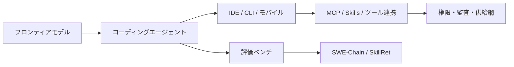

# AIエンジニアリング Digest 2026年5月前半版 — モデル / エージェント / OSS の話題まとめ

2026年5月前半、AIエンジニアリング界隈では「モデル性能の更新」以上に、**エージェントをどう安全に運用するか**が目立った半月でした。ChatGPTの既定モデル更新、Claude APIの退役告知、Codexのモバイル展開、Windsurf CLI、MCPのセキュリティ議論など、開発現場に近い話題が並んでいます。

この記事では、2026-05-01〜2026-05-17に話題になった動きをカテゴリ別に整理します。

---

## この半月の全体像

5月前半の流れを一枚で見ると、モデル単体の競争から、エージェント実行環境・権限・評価・供給網まで含む「運用基盤」へ論点が広がっています。

読み取りたいポイントは、エージェントの価値が「賢い応答」だけでなく、ツール連携、評価、権限設計まで含めて決まる段階に入ったことです。

---

## 1. フロンティアモデル：既定品質の更新と退役運用

### OpenAI: GPT-5.5 Instant が ChatGPT の新デフォルトに

OpenAIは5月5日の[ChatGPT release notes](https://help.openai.com/en/articles/6825453-chatgpt-release-notes%23h_4799933861)で、**GPT-5.5 Instant**をChatGPTへ展開したと記載しました。TechCrunchも新しい既定モデルとして報じています。

**実務への影響**  
ChatGPTの既定モデルが変わると、社内で使っている標準プロンプト、レビュー観点、長文要約、RAG補助の挙動が変わる可能性があります。特に「コンテキスト管理が改善した」系の更新は、長い設計資料や複数ファイルを扱うワークフローで差が出やすい領域です。

**筆者コメント**  
評価はポジティブです。既定モデルの底上げは、非専門ユーザーを含む開発組織全体の生産性に効きます。一方で、モデル差分を意識しない運用が増えると、品質の責任範囲が曖昧になります。標準プロンプトやRAGの回帰テストを持っているチームほど、恩恵を安定して受けやすいでしょう。

### OpenAI: セキュリティ特化 GPT-5.5-Cyber

TechRadarなどで、**GPT-5.5-Cyber**の限定提供が報じられました。AppSecやPSIRTに近いチーム向けに、脆弱性調査や修正支援を強化する流れです。

**実務への影響**  
脆弱性の調査、PoC確認、修正PR作成の速度が上がる期待があります。ただし、防御側だけでなく攻撃側の自動化も進みます。依存関係スキャン、権限分離、シークレット管理、CI上の安全確認の重要度はさらに上がります。

**筆者コメント**  
条件付きでポジティブです。専門家のワークフローを押し上げる一方、導入効果はモデル性能よりもアクセス制御、監査ログ、実行環境の隔離に左右されます。

### Anthropic: Claude API のモデル退役告知

Anthropicは[Claude API release notes](https://platform.claude.com/docs/en/release-notes/overview)で、Claude Sonnet 4 / Opus 4 の一部バージョンについて、2026年6月15日の退役予定を告知しました。

**実務への影響**  
モデルIDを固定して本番運用しているチームにとって、退役日は運用イベントです。品質、コスト、レイテンシ、ツール呼び出しの挙動が変わる可能性があるため、カナリア、AB評価、モデル切替時の自動テストが必要になります。

**筆者コメント**  
退役告知が明文化される点は評価できます。モデルの高速リリースが続くほど、アプリケーション側は「モデルを差し替えられる設計」を前提にしたほうがよくなります。プロバイダ抽象化、eval駆動、フォールバック設計は今後さらに重要になります。

### xAI: Grok Build がコーディングエージェント領域へ

Bloombergなどが、xAI初のコーディングエージェント **Grok Build** のロールアウトを報じました。

**実務への影響**  
Claude Code、Cursor、Codex、Copilotなどが競う領域に新しい選択肢が加わります。選択肢が増えるほど、現場では「どのツールが賢いか」だけでなく、コスト、監査、権限、IDE統合、再現性を比較する必要があります。

**筆者コメント**  
現時点では様子見です。コーディングエージェントはモデル能力だけで勝負が決まりません。長時間タスクの安定性、失敗時の復旧、社内ポリシーへの載せやすさが差分になります。

---

## 2. AIコーディングエージェント / IDE：IDE外へ広がる実行面

### OpenAI: Codex がモバイルへ

Axiosは5月14日、**CodexがChatGPTモバイルアプリに来る**と報じました。エージェントがIDEやWebだけでなく、モバイルからも操作される流れです。

**実務への影響**  
オンコール中や移動中に、軽い調査、レビュー、修正指示が可能になります。一方で、モバイルUIはdiffや実行計画の確認が薄くなりがちです。読み取り中心、PR作成まで、mainブランチへの変更不可など、端末別の権限設計が現実的です。

**筆者コメント**  
利便性は高いですが、ガバナンスとセットで見たい動きです。エージェントが利用される場所が増えるほど、制御面としての権限管理と監査ログが価値を持ちます。

### Claude Code: 週次更新と運用面の整備

Claude Codeは[Week 19更新](https://code.claude.com/docs/en/whats-new/2026-w19)や[changelog](https://code.claude.com/docs/en/changelog)で、継続的に変更を出しています。5月4〜8日の更新では、自動アップデート周りなど、業務利用に近い運用要素が見えます。

**実務への影響**  
CLIエージェントをチーム標準にすると、配布、バージョン固定、トラブルシュート、社内ドキュメント更新が課題になります。自動更新が便利になるほど、承認済みバージョンに固定したい企業運用との調整が発生します。

**筆者コメント**  
ポジティブです。2026年のエージェント競争では、生成性能よりも安定運用の作り込みが効いてきます。更新速度が速いツールほど、社内展開時には変更管理が必要です。

### Windsurf: CLI agent を前面に

Windsurfは5月6日の[changelog](https://windsurf.com/changelog)で、**CLI agent**を打ち出しました。IDEに閉じないエージェント利用が広がっています。

**実務への影響**  
CLI化はCI、リポジトリ操作、バッチ的な調査と相性が良いです。ただしCLIはローカルファイル、ネットワーク、コマンド実行に近い権限を持ちます。許可リスト、サンドボックス、シークレットの扱いを設計してから試すべき領域です。

**筆者コメント**  
自動化の観点では前向きです。比較軸としては、Claude CodeやCodexと同じく、フック、ポリシー、MCP連携、監査の成熟度を見たいところです。

---

## 3. OSS / ライブラリ：エージェントを壊れにくくする方向へ

### LangChain: Deep Agents v0.6

LangChainは5月13日に[Deep Agents v0.6](https://www.langchain.com/blog/deep-agents-0-6)を公開しました。ストリーミングをアプリケーションのプリミティブとして扱う方向が強調されています。

**実務への影響**  
長時間エージェントでは、途中経過の表示、キャンセル、リトライ、人間の介入が重要です。ストリーミングは単なるUI演出ではなく、観測性と制御性の土台になります。

**筆者コメント**  
評価はポジティブです。現場で詰まるのは、モデルの一発回答より、実行途中の見通しと復旧です。Deep Agentsの方向性は、エージェントをプロダクトに組み込むチームと相性が良いです。

### Pydantic AI: 継続的なリリース

[pydantic-ai](https://github.com/pydantic/pydantic-ai)は5月6日前後にも更新が続きました。型、検証、構造化出力に寄せたエージェント開発基盤として注目されています。

**実務への影響**  
LLM出力をそのまま信じるのではなく、型とバリデーションで境界を作る設計は、プロダクション利用で効きます。API呼び出し、DB書き込み、外部ツール実行の前段に契約を置ける点が強みです。

**筆者コメント**  
ポジティブです。LangGraphやCrewAIがフローやオーケストレーション寄りなら、Pydantic AIは入出力契約に寄っています。両者は競合というより補完関係として見るのが自然です。

---

## 4. MCP / Skills：便利な配管が攻撃面にもなる

### MCP の STDIO と供給網リスクが議論に

5月前半は、MCPのセキュリティ議論が大きく広がりました。VentureBeatは5月1日にSTDIO設計やレジストリ汚染の懸念を報じ、OX Securityも5月12日の[ブログ](https://www.ox.security/blog/new-mcp-security-flaws-kubectl-mcp-server-archon-os-and-markitdown-vulnerabilities/)で、kubectl MCPなどを含むリスクを整理しています。

**実務への影響**  
MCPはエージェントと外部ツールをつなぐ便利な配管ですが、ツール連携は実行権限そのものです。ローカルファイル、クラウド認証情報、kubectl、CIトークンに触れるMCPサーバは、侵入口にもなります。

**筆者コメント**  
ネガティブ寄りですが、健全な痛みでもあります。MCPを止めるより、社内許可レジストリ、署名、固定バージョン、サンドボックス、監査ログを導入条件にするほうが現実的です。標準化が進むほど、供給網セキュリティの重要度は上がります。

### Skills とハーネスの論点

エージェントが長時間・多段・並列に動く前提になると、モデルに全知を期待するより、外部化されたスキルを検索し、適切に実行する設計が必要になります。

**実務への影響**  
スキル配布は再利用性を高めますが、同時に審査、署名、権限境界の問題を持ち込みます。MCP、Skills、ツールレジストリは、開発者体験とセキュリティの両方を見て設計する領域です。

**筆者コメント**  
この流れは前向きです。エージェント活用がデモから運用へ移るにつれ、policy、observability、supply-chainを含むハーネスが主戦場になります。

---

## 5. 論文・技術記事：評価対象が実務に近づく

### SWE-Chain: 依存更新の連鎖で評価する

5月14日にarXivで公開された[SWE-Chain](https://arxiv.org/abs/2605.14415)は、実際のリリースノートとコード差分に基づき、パッケージ更新の連鎖を扱うコーディングエージェント評価です。

**実務への影響**  
依存更新、破壊的変更への追従、テスト修正は、現場で地味に重い作業です。Issue単体の修正より、継続保守に近い評価軸として参考になります。

**筆者コメント**  
強くポジティブです。エージェント評価が、派手なデモから保守作業へ寄ってきた点が良いです。今後は依存更新、セキュリティ修正、マイグレーションをまとめて測る流れが強まりそうです。

### SkillRet: スキル検索の評価

[SkillRet](https://huggingface.co/papers/2605.05726)は、大規模なスキル集合から必要なスキルを検索・分類するベンチとして紹介されました。

**実務への影響**  
エージェントがすべてを内包するのではなく、外部スキルを検索して使う構造になると、検索品質が成果に直結します。これはMCPやSkillsの設計にもつながります。

**筆者コメント**  
ポジティブです。ただし、スキルを配る仕組みは供給網リスクと表裏一体です。便利なスキルカタログほど、審査と署名の仕組みが求められます。

---

## 6. コミュニティの論点：便利さと安全性の綱引き

5月前半の議論で最も熱かったのは、MCPの安全性と、セキュリティ特化モデルの扱いでした。

MCPについては「便利だから使う」から一歩進み、「どのMCPサーバを信頼するのか」「どの権限で動かすのか」「実行ログをどう残すのか」が論点になっています。これは、npmやPyPIの供給網問題に近い構図です。

セキュリティ特化モデルについては、Mythosをめぐる議論とGPT-5.5-Cyberの報道が重なり、攻撃と防御の両方が加速する未来が改めて意識されました。現場としては、強いモデルを使うことより、隔離・監査・権限分離を強くすることが重要です。

---

## まとめ：5月前半に開発者が持ち帰る観点

- GPT-5.5 Instantにより、ChatGPTの既定体験が更新。標準プロンプトやRAGの回帰評価を見直す候補。
- Claude APIの退役告知は、モデル切替運用を整えるよいきっかけ。
- Codexモバイル、Windsurf CLI、Claude Code更新から、エージェントはIDE外へ広がっている。
- LangChain Deep AgentsとPydantic AIは、エージェントを観測可能かつ壊れにくくする方向。
- MCPは便利な標準になりつつあるが、供給網・権限・監査をセットで考えたい。
- SWE-ChainやSkillRetから、評価ベンチは実務の保守・スキル選択へ近づいている。

2026年5月前半のキーワードは、**モデル更新よりも運用設計**でした。次の半月も、エージェントをどう安全にチーム利用へ載せるかが中心テーマになりそうです。