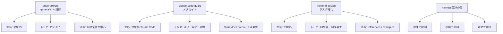
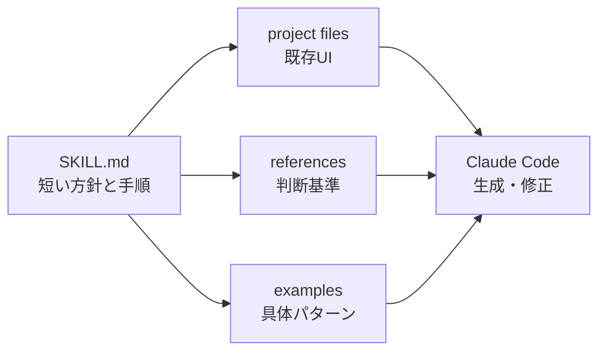
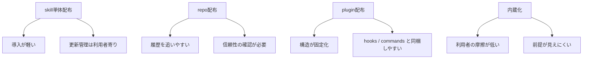

# claude-code-guide と frontend-design を読み解く — harness 設計 #2

前回は superpowers を題材に、著名 skill 集を「命名 / トリガ / 依存 / 配布形態 / 反復改善」の 5 観点で読む方法を整理した。今回は同じ順序を再利用して、`claude-code-guide` と `frontend-design` を読む。

この記事の狙いは、skill の書き方をコピペすることではない。公式・准公式チャンネルに近い skill が、どのように「タスク特化」「リソース駆動」「対話誘導」を設計しているかを読むことだ。

結論を先に言うと、superpowers が **generalist + 規律** に寄っていたのに対し、今回の 2 つは **特化 + リソース重視** に寄っている。これは優劣ではなく、harness のどこに責務を置くかの違いである。

## 今回読む 2 つの位置づけ

`frontend-design` は、Anthropic の `claude-code` リポジトリ内で `plugins/frontend-design/skills/frontend-design/SKILL.md` として確認できる。つまり、単体のプロンプト断片というより、plugin 配下に置かれた公式系 skill として読むのが自然だ。

一方、`claude-code-guide` は Claude Code 自身の使い方を Claude Code 上で案内する、メタガイド系 skill として流通している。Cult of Claude や skill ギャラリー経由で導線があり、公式内蔵というより repo 配布・ギャラリー配布の文脈で観測される。

この 2 つは性格がかなり違う。

- `claude-code-guide`: harness そのものを説明する自己言及的 skill
- `frontend-design`: フロントエンド設計というタスクに特化した skill

この違いが、5 観点で読むとかなり見えやすい。

## 比較の地図

以下は、前回の superpowers を含めた読み比べの地図である。

読み取ってほしい点は、公式系 skill が「全部を SKILL.md に詰める」方向ではなく、参照・配布・harness 側の分業を前提にしていることだ。

## 1. 命名: 何を引き受ける skill なのか

最初の観点は命名である。

`frontend-design` はかなり素直な名前だ。フロントエンドの設計、UI の構成、見た目の品質改善といった領域に閉じている。名前から「何でも相談できる万能設計者」ではなく、「frontend に関する design を扱う」と読める。

これは実務上かなり効く。skill 名は人間が呼ぶ名前であると同時に、Claude Code が自動ロードを判断する際の意味ラベルにもなる。抽象的な名前にすると、発火範囲は広がるが、期待される振る舞いが曖昧になる。`frontend-design` のような領域名は、呼び出しやすさと誤発火の少なさのバランスがよい。

`claude-code-guide` は別の意味で明確だ。これは「Claude Code を案内する skill」だと名前で宣言している。面白いのは、対象が harness 自身である点である。Claude Code の中で Claude Code の使い方を教える。つまり、skill が作業対象ではなく作業環境を説明する。

筆者の評価として、これはかなり強い命名だと思う。なぜなら、ユーザーの困りごとが「コードを書きたい」ではなく「Claude Code をどう使えばよいか分からない」にある場面で、発火すべき対象が明確だからだ。

superpowers と比べると違いは鮮明だ。superpowers は名前が魅力的な反面、何の作業に対して発火するのかは広い。前回見たように、generalist な skill 集は規律をまとめて持てる一方、命名だけではタスク境界が曖昧になりやすい。

## 2. トリガ: description は短い仕様書である

次にトリガを見る。Claude Code の skill では、frontmatter の description が「いつ読むか」の重要な手がかりになる。ここでは description を、短い自然言語の仕様書として読む。

`frontend-design` の description では、production-grade frontend interfaces や generic AI slop aesthetics を避ける、といった価値基準が示されている。ここで重要なのは、「UI を作る」だけでなく「どの品質を目指し、何を避けるか」まで入っていることだ。

実務への影響は大きい。自作 skill の description を「React コンポーネントを作る」だけにすると、単なる生成補助として発火しやすい。そこに「プロダクション品質」「AI っぽい汎用見た目を避ける」「既存デザインシステムに合わせる」といった成功条件を入れると、skill の役割が品質ゲートに近づく。

`claude-code-guide` のトリガは、より対話誘導寄りになる。たとえば「Claude Code の設定が分からない」「skill / hook / MCP の使い分けを知りたい」「プロジェクトに合わせた使い方を相談したい」といった、学習・迷い・選択の場面で効く。ここでは手順を押し付けるより、ユーザーの現在地を確認し、次の一歩を提示する設計が合う。

筆者としては、メタガイド系 skill の description には「説明する」だけでなく「ユーザーの環境に合わせて案内する」という語彙を入れたい。静的な README 要約に寄せると、Claude Code 上で使う意味が薄くなるからだ。

背景として、skill の自動適用は「文脈の分類」に近い。だから description は長文ルールではなく、分類されやすい短いラベルの束として設計するのがよい。今後は、発火率を実測しながら description を調整する運用が広がるはずだ。

## 3. 依存: SKILL.md を厚くしすぎない

3 つ目は依存である。ここでの依存とは、references、examples、scripts、MCP、hook など、skill 本文の外側にある支えを指す。

`frontend-design` は、タスク特化 skill が reference 群や examples を抱える典型として読める。フロントエンド設計では、色、余白、タイポグラフィ、コンポーネント構成、アクセシビリティ、状態表現、レスポンシブなど、判断材料が多い。これを SKILL.md に全部書くと、長文プロンプトが肥大化し、保守もしづらい。

そこで、SKILL.md は「いつ・どう読むか」のナビゲーションに寄せ、詳細な基準は references に逃がし、具体パターンは examples に置く設計が有効になる。

この図のポイントは、SKILL.md が中心ではあるが、知識の置き場を独占していないことだ。タスク特化 skill ほど、本文を薄くし、参照を厚くする設計が効いてくる。

`claude-code-guide` の依存は少し違う。対象が Claude Code 自身なので、上流ドキュメント、plugin reference、hooks reference、MCP docs、リリース差分などへの追従が品質を左右する。ここでは references だけでなく、「上流が変わった時にどう更新するか」が依存設計の一部になる。

実務では、この差が運用コストに直結する。frontend-design はデザイン規範やプロジェクト固有 UI に依存する。claude-code-guide は Claude Code の仕様変更に依存する。どちらも、skill 本文だけを見て品質を評価すると読み誤る。

superpowers との対比で言えば、superpowers は規律を内包することで広く効かせる設計だった。今回の 2 つは、規律を本文に抱え込むより、参照先や harness 側の能力へ分散している。筆者は、チーム運用では後者のほうが更新しやすいと見ている。

## 4. 配布形態: plugin、repo、内蔵化を分けて読む

4 つ目は配布形態である。ここを混同すると、同じ skill 名を見ていても話が噛み合わなくなる。

`frontend-design` は公式 repo の plugin 配下に置かれている。これは、skill が plugin という配布単位の中で管理される形だ。plugin には `skills/`、`hooks/`、`commands/`、`agents/` などをまとめられるため、チームに配る際の再現性が高い。

一方、`claude-code-guide` は repo 配布やギャラリー経由で導入される文脈が強い。導入は軽いが、更新の信頼性、参照先の鮮度、誰がメンテナンスしているかを利用側が見る必要がある。

さらに、公式内蔵に近い skill は、ユーザーが配布形態を意識しなくても使える方向へ進む。これは便利だが、harness の前提が見えにくくなる。たとえば、参照ファイルが同梱されているのか、MCP 接続が前提なのか、hook で安全境界を張る想定なのかを利用者が読み落としやすい。

筆者の評価では、チームで harness を設計するなら plugin 配布が有利だ。skill、hook、command、MCP 設定の責務を分けたまま配れるからである。ただし個人運用では repo 配布の軽さも捨てがたい。重要なのは、配布形態を設計要素として扱うことだ。

## 5. 反復改善: skill 本文ではなく参照先を育てる

最後は反復改善である。

`frontend-design` のような領域は変化が速い。UI の流行、コンポーネントライブラリ、CSS の書き方、アクセシビリティの期待値は更新される。ここで skill 本文に細部を固定すると、改善のたびに description や手順まで巻き込まれる。

そこで、公式系の設計から学べるのは「skill 本文を安定した入口にし、変わる知識は参照へ逃がす」ことだ。MCP を使えば外部リソースを取り込めるし、hook を使えば危険操作や規約違反を実行点で止められる。skill は対話と判断の誘導に寄せ、強制と外部接続は harness 側へ渡す。

`claude-code-guide` では、反復改善の焦点がさらに明確だ。Claude Code 自身を説明する以上、上流ドキュメントの更新に追従する仕組みが価値になる。今後のメタガイド系 skill は、単なる「使い方まとめ」から、プロジェクトの設定、利用者の習熟度、組織の運用ルールに合わせて案内を変えるコンポーネントへ進むだろう。

ここでも superpowers との違いが出る。superpowers は、開発プロセス全体に規律を入れることで改善を促す。一方、公式系 skill は、リソースと分業を使って改善余地を外に開いている。前者は強い作法を広く適用する設計、後者は狭いタスクを高い解像度で支える設計と言える。

## 公式 skill が暗黙に置いている harness 前提

今回の 2 つを読むと、公式系 skill は単独で完結する魔法のプロンプトではないことが分かる。暗黙に、次のような harness を期待している。

- skill は対話誘導と判断の入口を担う
- references / examples が詳細知識を担う
- hook が実行時のガードレールを担う
- MCP が外部リソースや更新される情報を担う
- plugin が配布と再現性を担う

これは現場のエンジニアにとって重要だ。公式 skill の書きぶりだけを真似ても、harness 側に hook や MCP、配布ルールがなければ同じ運用感にはならない。逆に言えば、自作 skill が伸び悩んでいる時、SKILL.md の文章量を増やす前に「どの責務を外へ出せるか」を見直す価値がある。

## まとめ: 公式は「狭く深く」、コミュニティは「広く律する」

前回の superpowers と今回の 2 題材は、衝突するものではなく補完関係にある。

superpowers からは、開発者の振る舞いを規律で整える発想を学べる。今回の `claude-code-guide` と `frontend-design` からは、対象タスクを絞り、参照を厚くし、harness と分業する発想を学べる。

5 観点でまとめると、こうなる。

| 観点 | claude-code-guide | frontend-design | superpowers との対比 |
|---|---|---|---|
| 命名 | Claude Code 自身を案内 | フロントエンド設計に特化 | superpowers は抽象度が高い |
| トリガ | 学習・迷い・設定相談 | UI 品質・制作要求 | 広く拾うより狭く当てる |
| 依存 | 上流 docs・運用知識 | references・examples | 規律内包より参照分散 |
| 配布形態 | repo / ギャラリー寄り | plugin 配下 | 公式は配布単位を重視 |
| 反復改善 | 上流追従が価値 | 参照差し替えが価値 | ルール更新よりリソース更新 |

読んで身につけたいのは、skill の文面そのものではない。命名で境界を作り、description で発火条件を作り、依存を外へ逃がし、配布形態で運用を固め、反復改善の場所を決める。この読み方を使うと、公式が考える skill 設計と、コミュニティが考える skill 設計の差を、自分の harness に引き寄せて言語化できる。

## 参考

- frontend-design SKILL.md  
  <https://github.com/anthropics/claude-code/blob/main/plugins/frontend-design/skills/frontend-design/SKILL.md>
- Claude Code Hooks reference  
  <https://code.claude.com/docs/en/hooks>
- Claude Code Plugins reference  
  <https://docs.claude.com/en/docs/claude-code/plugins-reference>
- Claude Code MCP docs  
  <https://code.claude.com/docs/en/mcp>
- What should I build: MCP, plugin, or both?  
  <https://claude.com/docs/connectors/building/what-to-build>
- claude-code-guide 配布導線例  
  <https://cultofclaude.com/skills/claude-code-guide/>