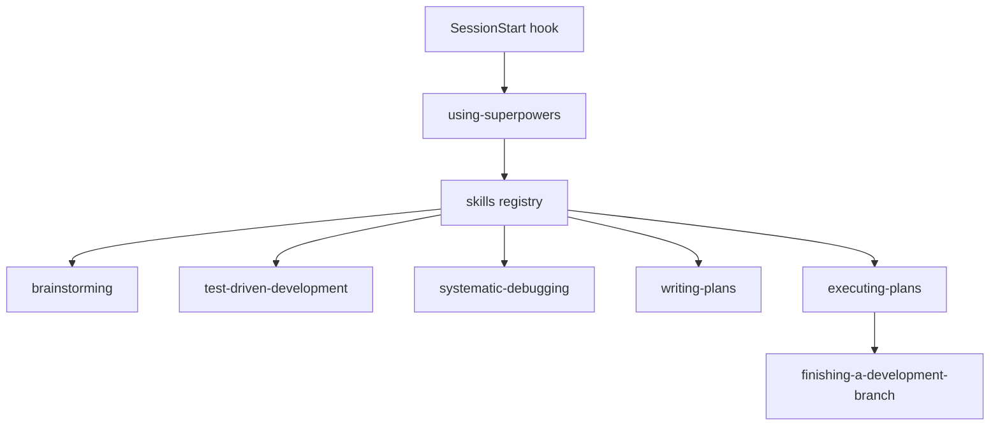
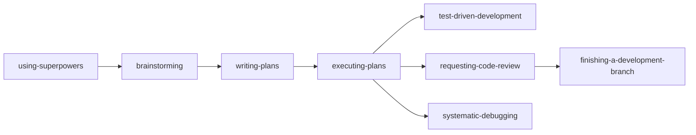
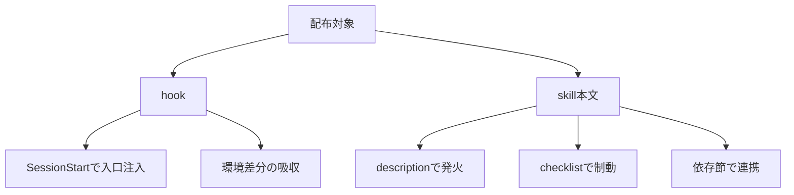

# obra/superpowers を読み解く — 著名 skill / hook 集から学ぶ harness 設計 #1

Claude Code で自作 skill / hook を書くようになると、次に気になるのは「大きく使われている skill 集は、どこが違うのか」です。

本連載では、著名な skill / hook 集を同じ観点で読み、各自の harness に移植できる設計パターンを抜き出していきます。第1回は [obra/superpowers](https://github.com/obra/superpowers) です。

本稿は Claude Code の skill / hook 仕様解説ではありません。前提知識はあるものとして、superpowers の構造を横に置きながら「どこを読むと設計意図が見えるか」に集中します。参照対象は 2026-05 時点の `obra/superpowers` です。実際に精読する際は、GitHub で対象ファイルを開き、`y` キーなどで commit hash 付き permalink に固定して読むと、後日の差分追跡がしやすくなります。

## 本記事で使う「読み解き 5 つの観点」

以後の記事でも、次の5観点を共通フレームとして使います。

| 観点 | 見るもの | harness へ移植する問い |
|---|---|---|
| 命名 | skill 名、hook 名、カテゴリ感 | いつ使う skill か名前で伝わるか |
| トリガ | description、red flags、checklist | どの状況で起動される設計か |
| 依存 | 他 skill への参照、Required/Recommended | 単体で成立するか、束で使う前提か |
| 配布形態 | hook、README、対応環境、ラッパ | どの環境でも同じ体験に近づくか |
| 反復改善 | release、contribution、更新規律 | 増築しても品質が崩れにくいか |

このフレームの狙いは、skill の本文を「良いプロンプト集」として読むだけで終わらせないことです。実務では、個々の文言よりも、入口、依存、更新の仕組みが運用品質を左右します。

## 1. 全体構造: using-superpowers が入口を作る

superpowers の特徴は、個別 skill の強さだけではなく、入口が設計されている点にあります。大まかには次の3層で読むと見通しが良くなります。

superpowers の入口から個別 skill へ流れる構造です。

図で見たいのは、`using-superpowers` が単なる説明文ではなく、後続 skill を探して使うためのメタ skill として機能している点です。

リポジトリ上では、`skills/using-superpowers/SKILL.md` が入口になり、`hooks/session-start` がセッション開始時の導線を担います。README でも Basic Workflow として `brainstorming`、`writing-plans`、`test-driven-development`、`requesting-code-review` などが並び、単発の便利 skill ではなく、作業の流れとして読むべき構成になっています。

実務への影響は明確です。自作 harness で「良い skill をいくつか用意したのに使われない」問題が起きる場合、足りないのは個別 skill ではなく入口かもしれません。superpowers は、利用者が毎回思い出して起動する前提ではなく、SessionStart から using-superpowers を入れることで、skill を探す姿勢をセッションの初期状態に寄せています。

筆者の評価として、この設計はかなり実務的です。ポジティブな点は、運用上の忘れやムラを hook で減らしていること。ネガティブな点は、hook が使えない環境や権限が厳しい環境では再現性が落ちることです。したがって自作 harness へ移植するなら、hook 経由の自動導入と、手動で呼べるフォールバックの両方を設計しておくのが扱いやすいです。

背景として、コーディングエージェントはセッションの初期文脈に強く影響されます。今後の skill 集は、単にファイルを配るだけでなく、「セッション開始時に何を注入するか」まで含めて製品化されていく流れが強まるでしょう。

参照: [README](https://github.com/obra/superpowers), [skills/using-superpowers](https://github.com/obra/superpowers/tree/main/skills/using-superpowers)

## 2. トリガ設計: description、red flags、checklist を読む

skill を読むとき、本文の手順より先に frontmatter の `description` を見ます。description は人間向けの要約であると同時に、「どの依頼でこの skill が候補に上がるか」を左右するトリガ文でもあります。

superpowers の skill は、名前も description も「何をするか」より「いつ使うか」を意識して読めます。たとえば `executing-plans` は、計画を実行する段階に入ったときの skill です。`systematic-debugging` は、バグ修正に入った瞬間だけでなく、試行錯誤が泥沼化しそうな場面で効きます。

特に注目したいのが `systematic-debugging` の red flags です。ここでは、推測で修正する、同じ種類の修正を繰り返す、十分な観察なしに変更する、といった危険な思考の兆候が明文化されています。さらに、兆候を検知したら調査フェーズへ戻る、という戻り先まで示されます。

これは単なるベストプラクティス集とは違います。一般的なプロンプトテンプレートは「良い手順」を並べがちですが、superpowers は「悪い状態に入りかけたサイン」をトリガにしています。

実務への影響として、自作 skill では次の3点をセットで考えると移植しやすくなります。

- description: 起動されるべき場面を短く書く
- checklist: 完了前に確認する項目を書く
- red flags: 戻るべき兆候と戻り先を書く

筆者の評価は、red flags を思考レベルで書く点が強い、というものです。エージェントの失敗は、最終成果物より前に「雑な仮説」「確認なしの修正」「テスト回避」として現れます。そこを検知対象にしているのは、現場のデバッグに近いです。

一方で、規律が強い skill は軽い修正にも儀式感を持ち込みます。小さな typo 修正にまで重い checklist が走ると、利用者は迂回したくなります。自作 harness では、description に「軽微な変更を除く」「複数回失敗したとき」などの粒度を入れ、発火範囲を調整する余地があります。

参照: [skills/systematic-debugging/SKILL.md](https://github.com/obra/superpowers/blob/main/skills/systematic-debugging/SKILL.md), [skills/executing-plans/SKILL.md](https://github.com/obra/superpowers/blob/main/skills/executing-plans/SKILL.md)

## 3. 依存設計: skill は単体ではなく束で読む

superpowers の skill は、個別ファイルだけをコピーしても同じ体験になりにくい構成です。各 skill が別の skill を参照し、ワークフローとして合成されているためです。

たとえば `subagent-driven-development` は、作業分割、計画、worktree、TDD、レビューなど、複数の skill と組み合わせて使う前提が強く出ています。`executing-plans` も、計画実行だけで閉じず、完了時の branch 仕上げやレビュー導線へ接続されます。

主要 skill 間の導線を簡略化すると、次のように読めます。

ここで重要なのは、矢印が「実行順そのもの」ではなく「参照されやすい関係」を示していることです。読むときは、各 skill の末尾にある Integration や Required workflow skills 相当の節を見て、依存グラフを起こすと理解が進みます。

実務への影響は大きいです。自作 harness へ移植する際、気に入った skill を1本だけ持ち込むと、前提となる planning や review の導線が抜けます。その結果、本文は立派でも運用で効果が薄くなります。移植するなら、核となるメタ skill、計画 skill、実行 skill、レビュー skill のように、小さな束で移すほうが安定します。

筆者の評価として、依存が文章で明示されている点は読み手に親切です。ブラックボックスな「なんとなく全部入れてください」ではなく、どの skill がどの skill を支えているかを追えます。一方で、依存が増えるほど導入コストは上がります。チームに入れる場合は、全移植ではなく、依存グラフから最小セットを切り出す編集が必要です。

背景として、skill は今後ますます「単体プロンプト」から「組み合わせ可能なワークフロー部品」へ寄っていくはずです。そのとき、Required / Recommended / Optional のような依存種別が、機械的に扱えるメタデータへ移る可能性があります。

参照: [skills/subagent-driven-development/SKILL.md](https://github.com/obra/superpowers/blob/main/skills/subagent-driven-development/SKILL.md)

## 4. 実装系 skill と規律系 skill を分けて読む

superpowers を読むときは、「コードを書く skill」と「進め方を縛る skill」を分けると理解しやすくなります。

`test-driven-development`、`systematic-debugging`、`brainstorming` は、実作業に近い skill です。ただし、ここでいう実装系は単にコード生成を促すものではありません。TDD ならテストを先に置く、debugging なら観察と仮説を分ける、brainstorming なら早すぎる実装に進まない、といった規律も含みます。

一方で、`writing-plans`、`executing-plans`、`requesting-code-review`、`finishing-a-development-branch` は、開発プロセスの骨格を作る規律系として読めます。実装内容そのものより、いつ計画し、いつレビューし、いつ branch を閉じるかを制御します。

この住み分けは、自作 harness でかなり効きます。よくある失敗は、1つの skill に「設計して、実装して、テストして、レビューして、PR まで仕上げる」を詰め込むことです。そうすると description が曖昧になり、発火条件も広くなります。superpowers のように、行為ごとに分け、依存でつなぐほうが、各 skill の責務が読みやすくなります。

筆者としては、規律系 skill を外部化している点を高く評価します。人間の開発チームでも、レビュー依頼や branch 仕上げは属人化しがちです。そこを skill に切り出すと、エージェントの振る舞いだけでなく、チームの作業文化も揃えやすくなります。

ネガティブ面は、規律が強いほど「重い」と感じられることです。特に小規模チームや個人開発では、全ワークフローを一気に導入すると摩擦が出ます。比較すると、軽量なプロンプト集は導入が楽ですが、長期運用で作業品質を揃える力は弱くなりがちです。superpowers は導入の軽さより、運用の再現性に寄せた設計と読めます。

今後は、実装系 skill よりも規律系 skill の価値が上がると見ています。コード生成の能力差が縮まるほど、差が出るのは計画、分割、検証、レビューの安定性だからです。

## 5. Hook と skill の連携: SessionStart は配布形態でもある

SessionStart hook は、単なる便利機能ではありません。superpowers においては、配布形態の一部です。

`hooks/session-start` は、セッション開始時に using-superpowers を注入する導線を担います。さらに、環境ごとの JSON 形式や実行差分を吸収するためのラッパが用意されています。これは「同じ skill 本文を、複数の harness / CLI / OS にどう届けるか」という配布設計の問題です。

hook と skill の役割分担を、次のように読むと移植しやすくなります。

この図の結論は、本文と外側を分けていることです。skill 本文はなるべく共通に保ち、hook やラッパで環境差分を吸収する。この分離は、大規模に配布する skill 集では重要になります。

実務への影響として、自作 harness でも「本文だけを Git 管理する」のか、「hook と導入スクリプトまで含めて配る」のかを早めに決めるべきです。本文だけなら軽いですが、使われ方は利用者に委ねられます。hook まで含めると導入は重くなる一方、入口を揃えやすくなります。

筆者の評価として、superpowers の hook 連携は OSS としてのスケールを意識した設計です。ポジティブには、忘れられがちな入口を機械的に揃えられます。ネガティブには、セキュリティレビュー、実行権限、Windows / Unix 差分など、skill 本文とは別の運用課題を持ち込みます。

比較すると、手動起動型の skill 集は安全で単純です。しかし「使うべき場面で使われない」問題が残ります。superpowers はそこに hook で踏み込み、運用の再現性を取りに行っています。

参照: [hooks](https://github.com/obra/superpowers/tree/main/hooks)

## 6. 反復改善: writing-skills 的なメタ規律を見る

最後の観点は反復改善です。superpowers は release が継続され、README や各 skill の構成からも、更新される skill 集として設計されていることがわかります。

ここで見るべきは、個別 skill の完成度だけではありません。新しい skill をどう追加するか、既存 skill の表現をどう直すか、依存が増えたときにどう整理するかです。大規模 skill 集では、初期の美しい設計より、増築時に壊れにくい規律のほうが効いてきます。

実務への影響として、自作 harness でも「skill を書く skill」や「skill 更新のレビュー観点」を用意すると、運用が楽になります。たとえば、新しい skill を追加する際に、命名、description、red flags、checklist、依存節、配布対象を確認する型を持つだけでも、ばらつきは減ります。

筆者の評価では、superpowers から学べる最大の点は、skill を成果物ではなく、継続改善される運用資産として扱っていることです。ネガティブ面としては、更新が続くほど古い記事やローカルコピーとのズレが出ます。だからこそ、読む側は commit hash 付き permalink、release note、ローカル導入版の差分を意識する必要があります。

背景として、AI harness はまだ変化が速い領域です。ツール名、hook 仕様、MCP 連携、マーケットプレイス側の露出形式が変わると、skill の良し悪しだけでは吸収できません。今後は、本文の改善と配布面の改善を分けて追える repository 設計がさらに重要になるでしょう。

## 自分の harness に移植するときの読み方

superpowers を読んで自作 harness に反映するなら、次の順でトレースするのがおすすめです。

1. `using-superpowers` を読み、入口で何を約束させているかを見る
2. `hooks/session-start` を読み、入口をどのタイミングで注入しているかを見る
3. README の Basic Workflow を見て、想定される標準ルートを把握する
4. `systematic-debugging` の red flags と checklist を読み、制動の書き方を学ぶ
5. `executing-plans` や `subagent-driven-development` の依存節を読み、依存グラフを起こす
6. 自分の harness では、全移植ではなく「入口 + 計画 + 実行 + 検証 + レビュー」の最小セットに落とす

この読み方をすると、superpowers は「便利 skill の詰め合わせ」ではなく、「エージェントに開発規律を適用するための harness 設計例」として見えてきます。

## まとめ

本稿では、obra/superpowers を次の5観点で読みました。

- 命名: 行為ベースの名前で適用タイミングを伝える
- トリガ: description、red flags、checklist で起動と制動を設計する
- 依存: skill を単体ではなくワークフローの束として読む
- 配布形態: SessionStart hook で入口を揃え、環境差分を外側で吸収する
- 反復改善: skill 集を継続更新される運用資産として扱う

superpowers から移植したい中心は、個々の文言よりも「入口を作り、危険な兆候で止め、依存でワークフロー化し、配布と更新まで設計する」という姿勢です。

次回以降は、この5観点を他の skill / hook 集にも適用し、superpowers と何が同じで何が違うのかを比較していきます。