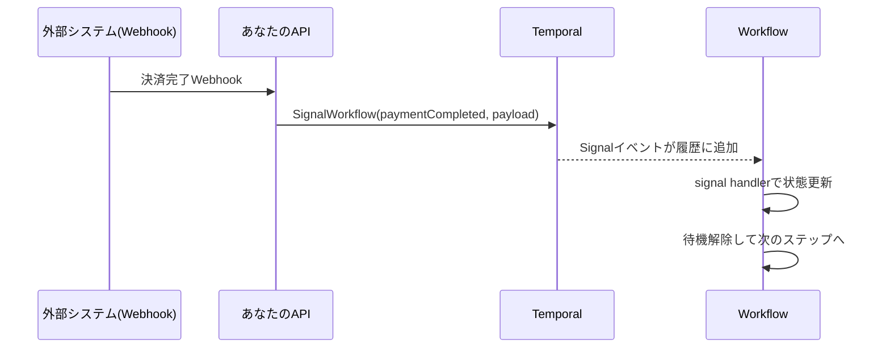
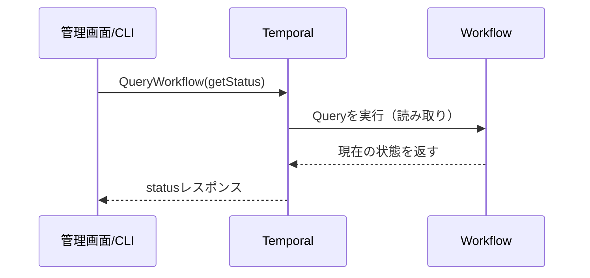
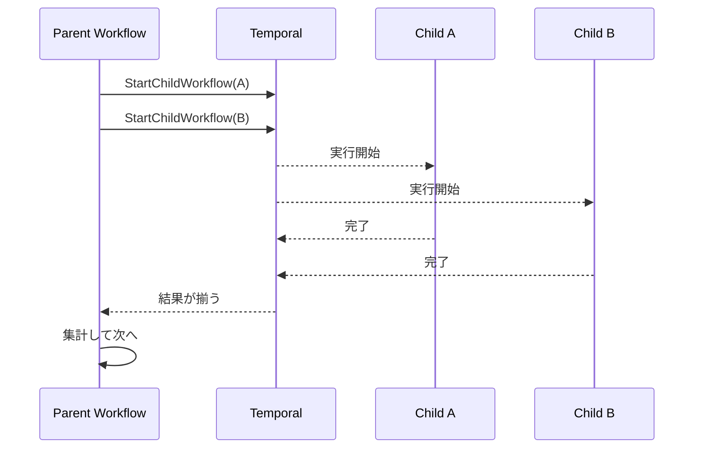
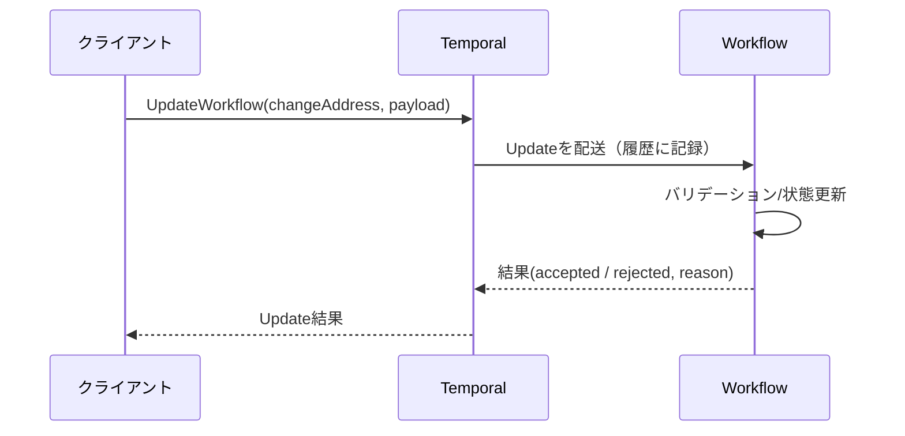

分散システムで「処理は動いてる。でも外から状態が見えない」「途中で人間の承認が要る」「サブ処理に分けたい」って、よくありますよね。  
Temporal だとこの手の“外部とのやりとり”を、**Signal / Query / Child Workflow**（＋最近の **Update**）で気持ちよく整理できます。

今日は「ワークフローにどう話しかけるか」「ワークフローをどう分割するか」を、概念と図で腹落ちさせましょう。

---

## まず全体像：Workflow は「長生きするプロセス」ではなく「履歴で再生できる状態機械」

Temporal の Workflow は、OS のプロセスみたいにメモリに常駐し続けるものではなく、**イベント履歴（History）からいつでも再生できる状態機械**なんですよね。

外部からの通信（Signal/Update）や参照（Query）が “安全に” できるのは、この前提があるからです。

---

## 1) Signal：外部イベントを Workflow に届ける（郵便受け）

### Signal って何？
**Signal は「Workflow に非同期メッセージを投げる」手段**です。  
イメージとしては、Workflow が家で、Signal は玄関の**郵便受け**。投函すると、Workflow の履歴に「手紙が届いた」が記録され、Workflow 側で受け取って処理できます。

- 非同期（送った側は基本的に待たない）
- 履歴に残る（再生しても“受け取った事実”が再現される）
- 外部イベント駆動（決済完了、ユーザー承認、在庫復活、など）に向く

### どんなときに使う？
- 「人間の承認」や「外部システムの完了通知」を待つ
- Webhook を受けたら Workflow に伝える
- 長い待機の途中でキャンセル/方針転換を伝える

### 図：Webhook → Signal → Workflow が続きから動く



### 最小スニペット（Go）
「届いた Signal を受けて、待っていた処理を進める」だけの最小形です。

```go
type PaymentSignal struct{ Paid bool }

func OrderWorkflow(ctx workflow.Context) error {
  var paid bool

  workflow.GetSignalChannel(ctx, "payment").Receive(ctx, &PaymentSignal{Paid: true}) // イメージ例

  // 実際は Select + ループ等で複数イベントを捌くことが多いです
  paid = true
  if !paid {
    return nil
  }
  // 次の処理へ
  return nil
}
```

> 実務では `workflow.Selector` で「タイマー」「複数 Signal」「Child の完了」などを同時に待つ形になりやすいです。今日は通信の概念が主役なので、ここは薄味でいきますね。

### Signal の設計メモ（地味に大事）
- **Signal 名は API として扱う**（互換性を意識）
- Payload は「冪等に扱える」形が安心（例：`status=PAID` のように“最終状態”を送る）
- 「同じ Signal が複数回届く」前提で Workflow 側は組む（ネットワークは気まぐれです）

---

## 2) Query：Workflow の状態を“読む”（覗き窓）

### Query って何？
**Query は「Workflow の現在状態を参照する」手段**です。  
郵便受け（Signal）が「投げ込み」だとすると、Query は玄関の**覗き窓**。中の様子を見られるけど、基本的に家の中は変えません。

- 読み取り（状態変更を目的にしない）
- 履歴にイベントとして残らない（＝状態変化の原因にはしない）
- UI での進捗表示・運用ツールの状態確認に向く

### 図：クライアントが Workflow の“今”を読む



### 注意点：Query は「今のメモリ状態」を見る
Query は「履歴イベント」ではなく、その時点の Workflow の状態を参照します。  
なので、次のような理解がしっくりきます。

- **Signal/Update：履歴に刻む（台帳に書く）**
- **Query：台帳を“編集せず”に読む**

運用では「Query が返す状態」と「外部 DB の状態」がズレて見える瞬間もあります。これは Temporal が悪いというより、**“分散システムの現実”が顔を出してる**だけなんですよね。

---

## 3) Child Workflow：Workflow を分割して連携する（部署を分ける）

### Child Workflow って何？
**Workflow の中から別の Workflow を起動して、親子関係で協調させる**仕組みです。

比喩で言うと、親 Workflow が「プロジェクトマネージャ」、Child Workflow が「各部署のチーム」みたいなものです。  
親は全体進行を握り、子は各自の責務を持って完遂し、結果を返す。

### 何が嬉しい？
- 責務分割：大きな Workflow を“読みやすい単位”にできる
- 失敗の局所化：子の失敗を親が扱いやすい形で受ける
- 再利用：同じ子 Workflow を別の親から使える
- 並列化：複数子を起動して待つ、がやりやすい

### 図：親が子を起動して、結果を集める



### 最小スニペット（Go）
親が子を呼んで結果を待つ、の最小形です。

```go
func Parent(ctx workflow.Context) error {
  var r string
  err := workflow.ExecuteChildWorkflow(ctx, Child, "input").Get(ctx, &r)
  return err
}

func Child(ctx workflow.Context, in string) (string, error) {
  return "ok:" + in, nil
}
```

### “Child にするか Activity にするか”の感覚（軽く）
- Activity：外部 I/O をする作業員（短〜中くらいの作業単位になりやすい）
- Child Workflow：状態機械をもう一段持つ「小さなオーケストレーター」

今日は Activity 深掘りはしませんが、迷ったら「その処理、途中で待機・外部イベント・分岐が増える？」を自問すると Child 寄りになりやすいです。

---

## 4) Update（概要）：Signal + Query の進化形（受付で処理して結果を返す）

Temporal の比較的新しい機能として **Update** があります（ここでは概要だけ）。  
立ち位置としてはこうです：

- Signal：投げっぱなし（非同期通知）
- Query：読むだけ
- Update：**状態変更要求を送り、Workflow が処理した結果を“返せる”**

比喩で言うと、Signal はポスト投函、Query は覗き窓、Update は**受付で申請して受理票をもらう**感じです。

### どんなときに嬉しい？
- 外部から「注文の配送先変更」みたいな **コマンド**を送りたい
- 「受け取ったか？」だけでなく「受理された」「この理由で拒否した」まで返したい
- クライアント側で同期的な体験（API の request/response）に寄せたい

### 図：Update は“処理結果”が返る



> Signal + Query でも「Signal 投げる → ポーリングで Query」みたいに組めますが、Update はその往復を一つの筋にしてくれる、という理解がしやすいです。

---

## 使い分けまとめ（持ち帰り用）

| 目的 | 手段 | ひと言で |
|---|---|---|
| 外部イベントで Workflow を進めたい | Signal | 郵便受けに投函 |
| Workflow の進捗や内部状態を見たい | Query | 覗き窓で見る |
| 大きな処理を分割し、責務を切りたい | Child Workflow | 部署を分ける |
| 状態変更要求を送り、結果も受け取りたい | Update | 受付で申請→受理票 |

---

## よくある設計の落とし穴（軽めに回避）

- **Query の結果を業務ロジックの真実扱いしすぎる**  
  Query は便利ですが、参照のタイミング問題がゼロになるわけではないです。ユーザー表示や運用確認に寄せると気持ちよく使えます。

- **Signal を「一回しか来ない前提」で書く**  
  Signal は “イベント” なので、重複・順序・再送といった現実が起こりえます。Workflow 側は状態遷移として安全に受けるのがコツです。

- **Child Workflow を作りすぎて迷子になる**  
  分割は読みやすさの薬でもあり、複雑さのスパイスでもあります。境界は「責務」「ライフサイクル」「再利用性」で決めるとブレにくいですよ。

---

## 次回予告（第4回）
次は「失敗が日常茶飯事な分散世界で、どう折れずに完走するか」を扱います。Retry / Timeout / エラーハンドリングなど、Temporal の“現場力”が出るところですね。

---

必要なら、あなたの題材（注文処理、バッチ、決済、アカウント作成など）に合わせて「Signal 名・状態モデル・Child 分割」を一枚図に落として一緒に設計もできますよ。