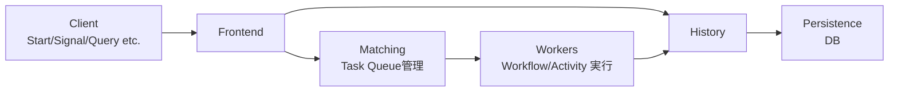
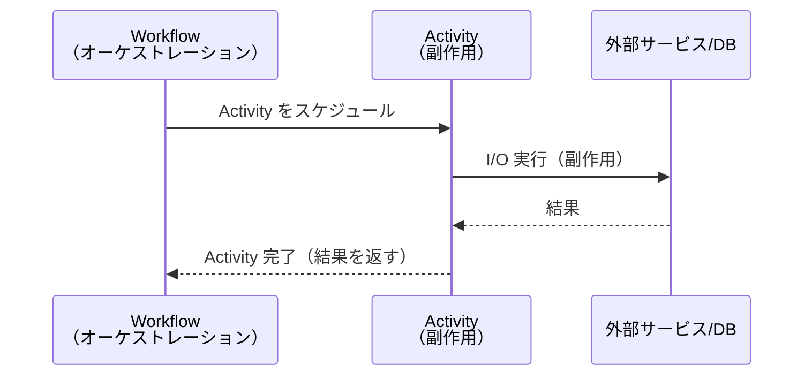
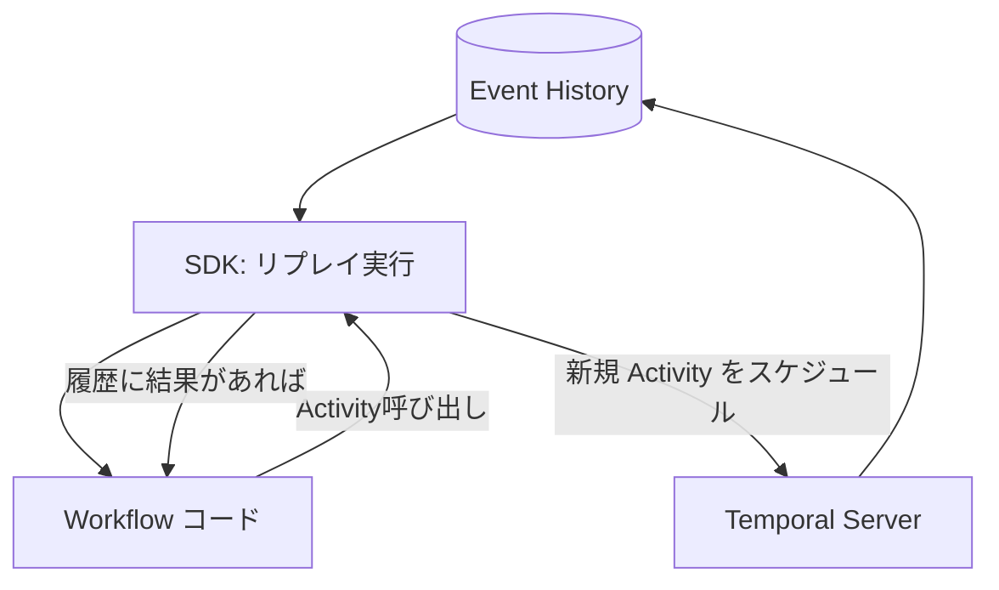

分散システムで「処理は進めたいが、落ちても続きから再開したい」「外部 API や DB を呼ぶので失敗がある」「どこまで終わったかが曖昧になる」といった課題に直面すると、状態管理・再実行・冪等性・可観測性をアプリ側で抱えがちです。Temporal はこれらを **Workflow と Event History** を中心に扱うことで、長時間・高信頼の処理を組み立てやすくします。

本記事（第2回）では、Temporal の **Workflow / Activity / Worker** と、それらを支える **Task Queue / Event History / リプレイ** を概念中心に整理します。

---

## 全体像：Temporal が提供する「実行モデル」

Temporal の基本は次の分離です。

- **Workflow**: 「何をどの順番でやるか」という *手順（オーケストレーション）* を表す
- **Activity**: 外部 I/O を伴う *実処理（副作用）* を表す
- **Worker**: Workflow/Activity を実行する *実行プロセス*
- **Temporal Server**: Event History とタスクの配布を担い、状態復元（リプレイ）を成立させる中枢

---

## Temporal Server のアーキテクチャ概要

Temporal Server は「アプリが書いた Workflow コードを実行する場所」ではなく、**履歴（Event History）を保ち、タスクを配り、進捗を合意された形で管理する場所**です。実際に Workflow/Activity のコードを動かすのは後述の Worker です。

代表的な構成要素を、役割ベースで簡略化すると次のようになります。



- **Frontend**: クライアントからの API を受ける窓口（実行開始など）
- **History**: Workflow の Event History（実行の記録）を管理
- **Matching**: Task Queue を管理し、Worker へタスクをマッチング
- **Persistence**: 履歴や各種メタデータを保存する DB（実装では複数 DB 構成もあり得ます）

この構造により、Worker が落ちたり再起動しても、Server 側に残った Event History を元に処理を継続できます。

---

## Workflow：役割と Deterministic Constraints（決定性の制約）

### Workflow の役割：オーケストレーション（手順の定義）

Workflow は「注文→決済→在庫引当→発送依頼」のような、**ビジネス手順そのもの**を表現します。重要なのは、Workflow が「進捗」を自前で DB に保存するのではなく、**Temporal が Event History とリプレイで進捗を復元する**点です。

Workflow の中では主に次を行います。

- Activity の呼び出し（＝副作用の実行依頼）
- 分岐やループなどの制御（＝手順の組み立て）
- 状態（ローカル変数など）を更新（ただし後述の決定性に従う）

### Deterministic Constraints：同じ履歴から同じ結果になること

Temporal は Workflow を「途中から再開」するために、Workflow を **リプレイ（再実行）** します。その際、Workflow コードが **同じ Event History を入力として、同じ制御フロー・同じ結果**に到達する必要があります。

この要請が **決定性（determinism）** で、Workflow には次のような制約が生まれます。

- 現在時刻（例: `time.Now()`）や乱数（例: `rand()`）など、実行ごとに値が変わるものをそのまま分岐条件に使うと、リプレイ時に分岐が変わり得る
- 外部 API / DB 呼び出しを Workflow 内で直接行うと、結果が変わり得る（かつ副作用が二重に起き得る）

Temporal SDK にはこの問題に対処するための仕組み（決定的な時間取得など）がありますが、本記事では「Workflow は決定的である必要がある」という原則を押さえるのが主目的です。

---

## Activity：役割と「副作用の分離」

### Activity は「外部世界との接点」

Activity は、次のような **副作用（外部 I/O）** を担う単位です。

- DB の読み書き
- 外部 API 呼び出し
- メッセージ送信
- ファイル操作 など

Workflow が「手順」を担い、Activity が「外部操作」を担うことで、次のメリットが得られます。

- Workflow の決定性を保ちやすい（外部 I/O を Activity に隔離）
- 障害時の再実行を設計しやすい（どこが副作用かが明確）
- テストがしやすい（Workflow のロジックと I/O を分けられる）

### Workflow と Activity の関係（概念図）



Workflow は Activity を「呼ぶ」というより、Temporal に「この Activity を実行して結果を返してほしい」と依頼します。実行担当は Worker です（次節）。

---

## Worker と Task Queue：どうやって実行が回るか

### Worker：実行プロセス（ランタイム）

Worker は、あなたのアプリケーションとして動くプロセスで、次の役割を持ちます。

- Task Queue をポーリングしてタスクを受け取る
- Workflow Task を処理して「次に起こすべきこと」を決める
- Activity Task を処理して外部 I/O を実行する
- 結果を Temporal Server に報告し、Event History に反映させる

### Task Queue：タスクの配送先を決める論理キュー

Task Queue は「どの Worker がこのタスクを処理するか」を決めるための名前付きキューです。典型的には次のように使います。

- `payments` キュー：決済関連の Workflow/Activity を扱う Worker 群
- `shipping` キュー：発送関連を扱う Worker 群

Task Queue を分けることで、スケールや権限分離（ネットワーク到達性の違いなど）を設計しやすくなります。

### Workflow Task と Activity Task（2種類のタスク）

Temporal の実行は大まかに以下の2種類のタスクで流れます。

- **Workflow Task**: Workflow コードを進めるためのタスク  
 （「履歴を見て次はどの Activity をスケジュールするか」を決める）
- **Activity Task**: Activity を実行するためのタスク  
 （外部 I/O を実際に行う）

この分離が、オーケストレーションと副作用の分離を支えています。

---

## Event History と状態復元（リプレイ）：Temporal の中核

### Event History：Workflow の「実行ログ」

Temporal は Workflow の進捗を、内部的に **Event History** として保存します。Event History には例えば次のようなイベントが並びます。

- Workflow が開始された
- Activity A をスケジュールした
- Activity A が完了し、結果が返った
- 次の Activity B をスケジュールした
- ……

ポイントは、「Workflow のローカル変数そのもの」を永続化するのではなく、**意思決定に必要な出来事をイベントとして蓄積**する点です。

### リプレイ：履歴から Workflow を再構築する

Worker が Workflow Task を処理するとき、SDK は次を行います。

1. Server から該当 Workflow の Event History を受け取る（または差分を受け取る）
2. Workflow コードを先頭から実行し直す（リプレイ）
3. 履歴上すでに起きた Activity の結果は、再実行せずに履歴から復元して Workflow に渡す
4. 新しく必要になった決定（例: 次の Activity をスケジュール）だけを Server に返す

これにより、Worker が落ちても別の Worker が同じ履歴でリプレイし、同じ地点まで到達できます。ここで Workflow の決定性が重要になります。

### リプレイの流れ（図解）



- 過去に完了している Activity の結果は Event History から返る  
- 新しく必要になった Activity だけがタスクとしてキューに流れる

---

## 最小スニペット：Workflow と Activity の「見た目」

コードは最小限に留め、雰囲気だけ示します（言語や SDK により API は異なります）。

```go
// Workflow: 手順を書く（副作用は直接しない）
func OrderWorkflow(ctx workflow.Context, orderID string) error {
    var receipt string
    err := workflow.ExecuteActivity(ctx, ChargePayment, orderID).Get(ctx, &receipt)
    if err != nil { return err }

    return workflow.ExecuteActivity(ctx, ReserveStock, orderID).Get(ctx, nil)
}

// Activity: 外部 I/O をやる
func ChargePayment(ctx context.Context, orderID string) (string, error) {
    // 決済 API 呼び出しなど（副作用）
    return "receipt-xxx", nil
}
```

この形にすると、Workflow は「どの順で何をするか」に集中でき、外部 I/O は Activity に集約されます。

---

## まとめ：3要素と履歴がつながると何が起きるか

- **Workflow** は「手順」を表し、リプレイ可能な（決定的な）コードとして書く
- **Activity** は「副作用」を担い、外部 I/O をここに寄せる
- **Worker** は Task Queue からタスクを受け取り、Workflow/Activity を実行して Server に結果を返す
- **Temporal Server** は Event History を管理し、履歴に基づく状態復元（リプレイ）で継続実行を成立させる

次回（第3回）では、Workflow を外部から動かすための仕組み（Signal / Query / Child Workflow）を扱い、「実行中の Workflow とどう対話するか」を整理します。