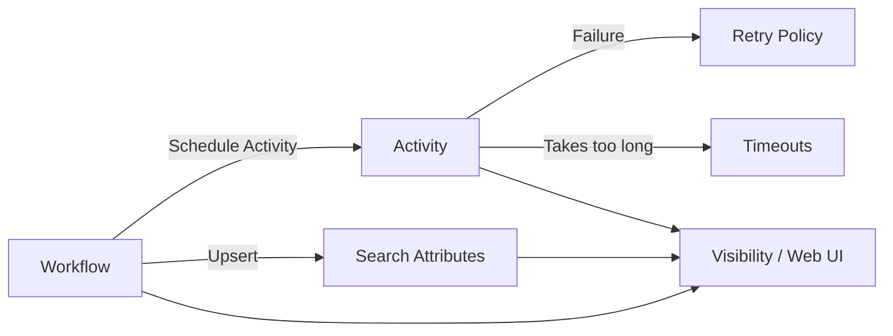

分散システムって、放っておくと「連絡がつかない取引先」「何度も同じ電話をかける担当者」「期限が書かれてない依頼書」が同時多発する世界なんですよね。  
Temporal はそこを、**再試行（Retry）**と**時間制約（Timeout）**と**観測（Visibility）**で、運用できる形に整えてくれます。

基本編の最終回は「本番で困らないための3点セット」を、設計の芯から整理しましょう。

---

## 0. まず全体像：Temporal の“信頼性レイヤ”はこの3つ

- **Retry**: 失敗したら、賢くやり直す（ただしやりすぎない）
- **Timeout**: いつまでも待たない。いつまでに終わるべきかを決める
- **Visibility**: 何が起きているかを「検索できる状態」にして、運用で勝つ

図にするとこんな関係です。



---

## 1. Retry Policy 設計：リトライは「保険」じゃなくて「交通整理」

リトライって、気持ち的には「失敗しても大丈夫な保険」なんですが、実際は**システム全体の渋滞を防ぐ交通整理**なんですよね。  
むやみに再試行すると、障害時に一斉リトライで雪崩が起きます（外部APIもDBも巻き添え）。

Temporal の Retry Policy は、主に以下を設計します。

- `InitialInterval`: 最初の待ち時間
- `BackoffCoefficient`: 次をどれだけ伸ばすか（指数バックオフ）
- `MaximumInterval`: 待ち時間の上限
- `MaximumAttempts`: 何回まで試すか
- `NonRetryableErrorTypes`: リトライしない失敗の分類

### 1.1 設計指針：まず「失敗」を2種類に分ける

リトライ設計のコツは、例外処理の書き方ではなくて、失敗を分類することです。

- **一時的（Transient）**: タイムアウト、レート制限、ネットワーク断、503 など  
  → リトライの価値がある
- **恒久的（Permanent）**: バリデーションエラー、存在しないID、権限不足など  
  → リトライしても結果は変わりにくい

Temporal 的には、恒久的なものを `NonRetryableErrorTypes` に寄せると、運用が落ち着きます。  
「何回やってもダメな注文書を、郵便局が何度も配達しに行く」みたいな状態を避けたいんですよね。

### 1.2 パラメータの考え方（InitialInterval / Backoff / MaxAttempts）

**InitialInterval** は「最初の深呼吸」です。速すぎると相手の復旧前に突撃します。

**BackoffCoefficient** は「だんだん距離を取る」動き。  
障害時に全員が同じテンポで並ぶと行列が伸びるので、指数バックオフで散らします。

**MaximumAttempts** は「諦めどころ」。ここはビジネス要件とセットです。  
「どれくらい遅れてもよいか」「失敗したら人手介入なのか」を決めると自然に決まります。

設計の出発点としてはこんなイメージです。

- 外部APIが一時的に落ちる前提がある → `InitialInterval` は秒〜十数秒、バックオフあり
- ユーザー操作に近い処理で、待たせたくない → 試行回数は控えめ、早めに失敗させる
- バッチや非同期処理で「いずれ成功すれば良い」 → 試行回数や総時間を少し長めに

### 1.3 最小スニペット（Go）：Activity の RetryPolicy

コードは要所だけ。

```go
ao := workflow.ActivityOptions{
  StartToCloseTimeout: 30 * time.Second,
  RetryPolicy: &temporal.RetryPolicy{
    InitialInterval:    2 * time.Second,
    BackoffCoefficient: 2.0,
    MaximumInterval:    1 * time.Minute,
    MaximumAttempts:    6,
    NonRetryableErrorTypes: []string{
      "ValidationError",
      "PermissionDenied",
    },
  },
}
ctx := workflow.WithActivityOptions(ctx, ao)
```

ここで大事なのは「数字そのもの」より、**なぜその数字にしたか**の説明ができることです。  
運用で調整するときに、その“根拠”が効いてきます。

---

## 2. Timeout 整理：Temporal の締切は「種類が多い」けど、理由がある

Temporal の Timeout は最初ややこしいんですが、現実の仕事に寄せると腹落ちします。

- **StartToClose**: 作業を始めてから終えるまでの締切（作業時間）
- **ScheduleToStart**: キューに入ってから着手するまでの締切（着手待ち時間）
- **ScheduleToClose**: 依頼してから完了までの締切（トータルの締切）
- **Heartbeat**: 「生存報告」が途切れたらアウト（長時間作業の見守り）

たとえるなら、ラーメン屋です。

- `ScheduleToStart`: 行列に並んでから席に着くまでの限界
- `StartToClose`: 着席してから食べ終えるまでの限界
- `ScheduleToClose`: 並び始めてから退店までの合計制限
- `Heartbeat`: 「まだ麺を茹でてます」って厨房から声が聞こえないと不安、みたいなやつです

### 2.1 Activity Timeout の関係（図解）

```mermaid
sequenceDiagram
  participant W as Workflow
  participant Q as Task Queue
  participant WK as Worker
  W->>Q: Schedule Activity
  Note over Q: ScheduleToStart
  Q->>WK: Dispatch Task
  Note over WK: StartToClose
  WK-->>W: Complete/Fail

  Note over W,Q,WK: ScheduleToClose = 全体の上限（待ち + 実行）
```

整理のポイントはこれです。

- 実行が遅いのか（`StartToClose`）
- ワーカー不足で詰まっているのか（`ScheduleToStart`）
- とにかく全体が長いのか（`ScheduleToClose`）

同じ「遅い」でも、運用の打ち手が変わりますよね。

### 2.2 Heartbeat Timeout：長い Activity の“安否確認”

長時間の Activity（重いファイル処理、巨大なAPI呼び出しのポーリングなど）は、`StartToClose` を長く取るだけだと「固まってるのか進んでるのか」が分かりません。  
そこで Heartbeat です。

- ワーカーは定期的に `RecordHeartbeat` する
- 途切れたら Temporal が「これは落ちた/詰まったかも」と判断できる
- 再試行時に Heartbeat details を使って途中から再開、も可能（詳細は応用編に譲ります）

概念だけ押さえるなら、Heartbeat は「長距離運転中の位置情報共有」みたいなものです。沈黙が一番こわい。

### 2.3 Workflow 側の Timeout もある（でも今日は整理だけ）

Workflow には `WorkflowRunTimeout` / `WorkflowExecutionTimeout` / `WorkflowTaskTimeout` などがあります。  
基本編では深入りしませんが、考え方は一貫していて「いつまでも走らせない」ための上限です。

運用上はまず **Activity の Timeout をきちんと置く**のが効きます。外部I/Oはここに集中しやすいので。

---

## 3. Visibility と Search Attributes：運用で勝つには「後から探せる」こと

Temporal を触っていて、地味に嬉しいのが Visibility です。  
要するに「今この注文（Workflow）がどこで詰まってる？」を検索できる仕組みですね。

### 3.1 Visibility は “ログ” ではなく “台帳”

ログは時系列で流れていきますが、Visibility は「台帳」なんですよ。  
- いま何が進行中か
- どの顧客の注文か
- どのリージョンか
- どのステータスか

を **検索して引ける**。障害対応での“現場感”が変わります。

### 3.2 Search Attributes（検索属性）：付け札を貼る

Search Attributes は Workflow 実行に対して付ける「付け札」です。  
たとえば以下みたいな属性があると、運用が一気に楽になります。

- `CustomerId`
- `OrderId`
- `Region`
- `Env`（prod / staging）
- `WorkflowVersion`（移行期に効く）
- `Status`（ドメイン状態を粗く反映）

Temporal Web UI で「`CustomerId=123` の実行だけ見たい」ができます。

#### Upsert の最小スニペット（概念用）

```go
workflow.UpsertSearchAttributes(ctx, map[string]interface{}{
  "CustomerId": customerID,
  "Region":     region,
  "Status":     "PAYMENT_PENDING",
})
```

設計のコツは、Search Attributes を「何でも入れる箱」にしないことです。  
おすすめはこの2つの用途に絞ること。

1. **問い合わせ導線**: CSや運用が持ってくるキー（注文ID、顧客ID）
2. **運用アクション導線**: どれを優先して復旧するかの判断材料（リージョン、状態、優先度）

---

## 4. Web UI の活用：インシデント時の“指令室”

Temporal Web UI は、慣れると「指令室」になります。  
見るべきポイントを絞ると、初見でも戦えます。

### 4.1 まず見る場所（最低限）

- **Workflow 一覧（進行中 / 失敗 / 完了）**
- **Workflow の History**
  - どの Activity が失敗しているか
  - 何回リトライしたか
  - Timeout で落ちたのか、アプリ例外なのか
- **Retry / Timeout の情報**
  - 次回のリトライ予定
  - どの Timeout が発火したか

History は「事件現場の実況中継」みたいなものです。  
アプリログが散らばっていても、Temporal 側のイベント列は一貫して追えます。

### 4.2 検索の使い方：まず “狭めて” から掘る

運用でよくやる動きはこれです。

1. Search Attributes で対象を絞る（例：`OrderId=...` / `CustomerId=...`）
2. 実行を開いて History を見る
3. 失敗点が Activity なら、その Activity のエラーとリトライ状況を見る
4. 「再試行で待てば復旧する話か」「恒久失敗か」を判定する

これができると、障害時の調査が「ログ職人芸」から「台帳ベースの捜査」になります。

---

## 5. 本番運用の設計まとめ：Retry × Timeout × Visibility の噛み合わせ

ここまでを、設計のチェックリストにするとこうです。

### 5.1 Retry 設計チェック
- 失敗を transient / permanent に分けたか
- permanent を `NonRetryableErrorTypes` に寄せたか
- 障害時に一斉リトライにならない待ち方（バックオフ）になっているか
- 「諦めどころ（MaxAttempts）」の後、どう運用するか決まっているか

### 5.2 Timeout 設計チェック
- `StartToClose` は “通常時に収まる” 現実的な値か
- ワーカー詰まりを検知したいなら `ScheduleToStart` も意識したか
- “依頼全体の締切” があるなら `ScheduleToClose` を置いたか
- 長時間 Activity なら Heartbeat の検討をしたか

### 5.3 Visibility 設計チェック
- 問い合わせキー（顧客ID/注文ID）で検索できるか
- 状態やリージョンなど、運用判断に必要なタグがあるか
- Web UI で「絞って→掘る」の動線ができているか

---

## 6. 基本編の総まとめ：Temporal が提供しているのは「実行のOS」みたいなもの

この基本編では、Temporal を「分散システムの実行を管理する基盤」として見てきました。

- 第1回：なぜ必要か（分散のつらさを吸収する）
- 第2回：Workflow / Activity の基本構造
- 第3回：実装パターンの基本（進め方の型）
- 第4回（本記事）：運用で勝つための Retry / Timeout / Visibility

Temporal は、アプリの中に「状態管理・再実行・観測」を埋め込む代わりに、**そのへんをまとめて引き受ける実行基盤**なんですよね。  
アプリが“業務ロジック”に集中できるようになります。

---

## 7. 応用編への橋渡し：次は「現実の泥」をどうさばくか

基本編では、運用の土台までを固めました。次の応用編（別シリーズ）では、もう一段リアルな話に入っていきます。たとえば：

- 長時間処理の進捗管理や、途中再開の設計
- 複数サービス連携での失敗の扱い（補償や巻き戻し“以外”の選択肢も含む）
- バージョニング、移行、ワーカー運用、可観測性の深掘り
- 大規模運用でのスケール設計（タスクキューやスループットの考え方）

このへんは「Temporal を知っている」から「Temporal で設計できる」へ進むパートです。  
基本編で入れた Retry / Timeout / Visibility の考え方が、そのまま土台になりますよ。

---

### 付録：用語の超短い再確認
- **Retry Policy**: 失敗時にどうやり直すかのルール
- **Timeout**: どこまで待つかの締切（種類で意味が変わる）
- **Visibility / Search Attributes**: 実行を検索・運用するための台帳情報
- **Web UI**: その台帳と履歴を見て、状況判断する場所

---

次に読みたい方向（応用編）に合わせて、「この業務だと Search Attributes は何を入れると良い？」とか「この外部APIにはどの Timeout を置く？」みたいな相談ベースで詰めるのも楽しいですよね。