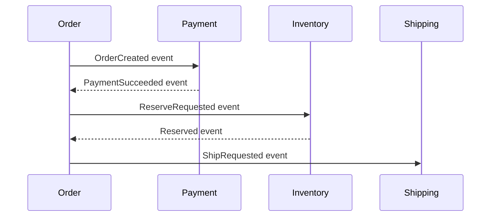
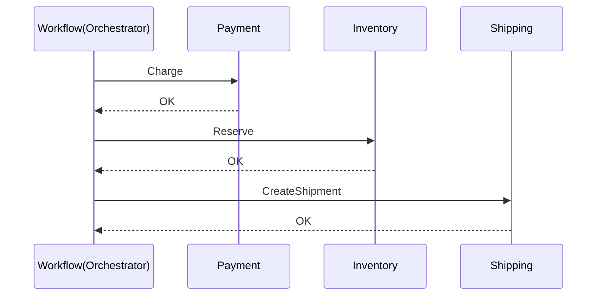
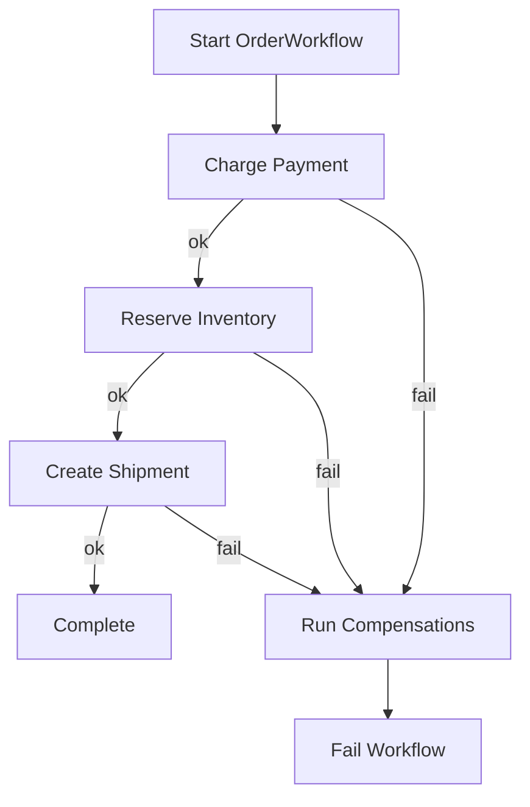

分散トランザクションって、「みんなで引っ越し」みたいなものなんですよね。  
冷蔵庫を運ぶ人、段ボールを運ぶ人、鍵を返す人…それぞれの作業は進むけど、途中で雨が降ったりトラックが故障したりする。そんなとき「じゃあ最初から巻き戻して“なかったこと”にしよう」が難しいわけです。

そこで出てくるのが **Saga パターン**。  
Temporal は “ワークフローという台本” を持っているので、Saga と相性がかなり良いんですよ。

この記事では、Temporal で **補償アクション（Compensation）つきの分散トランザクション**を実装するところまでを、注文処理を題材にやっていきましょう。

---

## この記事のゴール

- Saga パターン（Choreography / Orchestration）の違いを腹落ちさせる
- Temporal で Saga を「ワークフロー＋補償」で組む基本形を掴む
- 失敗時のロールバック戦略（どこまで戻す？何は戻せない？）を設計できる
- 実践的な Go コード（注文→決済→在庫→配送）を書ける

---

## Saga パターン概要：Choreography vs Orchestration

Saga はざっくり言うと、

- **複数のローカルトランザクションを順に実行**
- 途中で失敗したら、すでに成功した分を **逆向きに打ち消す（補償）**

という考え方です。

### Choreography（群舞型）

各サービスがイベントを見て自律的に動きます。



- 良いところ: 中央司令塔がなく疎結合
- しんどいところ: 全体の流れが把握しづらく、失敗時の補償が散らばりがち

イベントが増えると「盆踊りの輪が大きくなりすぎて、誰が次に踊るのか分からない」状態になりやすいんですよね。

### Orchestration（指揮者型）

中央に「指揮者」がいて、各サービス（演奏者）に順番に指示します。



- 良いところ: 1か所にロジックが集まり、可視化しやすい。補償の順序も管理しやすい
- しんどいところ: 指揮者が賢くなる（ただし Temporal がかなり肩代わりしてくれます）

Temporal で Saga をやるなら、基本は **Orchestration** がとてもやりやすいです。ワークフローが「指揮者」を自然に担えます。

---

## Temporal での Saga 実装パターン（基本形）

Temporal の Saga は「専用機能がある」というより、ワークフローの性質を使って **堅牢に組める**のがポイントです。

よく使う形はこれです：

1. Activity で外部副作用（決済、在庫確保など）を実行
2. 成功したら、その時点で「失敗時にやる補償」をスタックしておく
3. 途中で失敗したら、積んだ補償を **逆順** に実行して戻す

「やったことをメモしておいて、帰り道は逆順に片付ける」。引っ越しの撤収作業と同じノリです。

---

## 補償アクション（Compensation）の設計ポイント

補償は「ロールバック」ではなく「打ち消し」です。DB のトランザクションみたいに完全に元に戻る保証はありません。だから設計が大事です。

### 1) 補償は冪等（idempotent）にする

Temporal はリトライします。補償も例外ではないので、「同じ補償が複数回走っても壊れない」形にします。

- 決済の返金: `Refund(paymentID)` は二重実行されても「既に返金済み」を安全に扱う
- 在庫予約解除: `Release(reservationID)` は「予約がない」なら成功扱いにする

### 2) 補償は“起きた事実”に紐づける

補償の引数は「注文ID」だけで済ませず、**成功した結果として得たID**を保存しておくのがコツです。

- `Charge` の結果 `paymentID`
- `Reserve` の結果 `reservationID`
- `CreateShipment` の結果 `shipmentID`

この“領収書”がないと、補償が曖昧になって事故りやすいんですよね。

### 3) 補償できないものを先に決める

例えば「配送会社に引き渡した後」は戻せないことが多い。  
その場合は補償ではなく、

- キャンセル要求（best-effort）
- 人手対応のチケット起票
- 監視・アラート

みたいな「撤収プランB」を用意します。Saga は魔法の消しゴムではなく、良い消しゴム＋現実的な運用、という感じです。

---

## 失敗時のロールバック戦略（どこまで戻すか）

ここは設計判断の要です。代表的には次の分類をします。

### A. “きれいに戻せる”副作用
- 在庫予約解除
- 決済オーソリ取り消し
- 内部DBの状態戻し（ただし別トランザクションで）

→ 補償を自動実行しやすい

### B. “戻せるが時間がかかる/失敗しうる”副作用
- 返金（決済事業者の都合で遅延）
- 外部システムの取り消し（APIの不安定さ）

→ Temporal のリトライ＋タイムアウト設計が効いてきます

### C. “戻せない”副作用
- 発送済み
- メール送信（送った事実は戻らない）

→ “補償”ではなく「次善策」（訂正メール、返送フローなど）を別ワークフローに切り出す判断もあります

---

## 実装：Temporal × Go で注文 Saga を書く

題材はシンプルに：

1. 決済（Charge）
2. 在庫確保（ReserveInventory）
3. 配送作成（CreateShipment）

途中で失敗したら、成功した分を逆順で補償します：

- 配送作成済みならキャンセル
- 在庫確保済みなら解放
- 決済済みなら返金

### 全体像（図）



---

## Go コード例：Workflow（補償スタック方式）

ポイントだけに絞って載せます。

- 成功したら補償関数を `compensations` に積む
- 失敗したら `defer` で回収（逆順実行）
- Activity のタイムアウトとリトライは明示

```go
package order

import (
	"time"

	"go.temporal.io/sdk/temporal"
	"go.temporal.io/sdk/workflow"
)

type OrderInput struct {
	OrderID   string
	UserID    string
	AmountJPY int
	SKU       string
	Qty       int
	AddressID string
}

type Activities interface {
	ChargePayment(ctx context.Context, orderID, userID string, amountJPY int) (paymentID string, err error)
	RefundPayment(ctx context.Context, paymentID string) error

	ReserveInventory(ctx context.Context, orderID, sku string, qty int) (reservationID string, err error)
	ReleaseInventory(ctx context.Context, reservationID string) error

	CreateShipment(ctx context.Context, orderID, addressID string) (shipmentID string, err error)
	CancelShipment(ctx context.Context, shipmentID string) error
}

func OrderWorkflow(ctx workflow.Context, in OrderInput) (string, error) {
	ao := workflow.ActivityOptions{
		StartToCloseTimeout: 30 * time.Second,
		RetryPolicy: &temporal.RetryPolicy{
			InitialInterval: 200 * time.Millisecond,
			BackoffCoefficient: 2.0,
			MaximumInterval: 5 * time.Second,
			MaximumAttempts: 8,
		},
	}
	ctx = workflow.WithActivityOptions(ctx, ao)

	logger := workflow.GetLogger(ctx)

	// LIFO で補償を積む
	var compensations []func(workflow.Context) error
	runCompensations := func(cctx workflow.Context) error {
		// 逆順
		for i := len(compensations) - 1; i >= 0; i-- {
			if err := compensations[i](cctx); err != nil {
				// 補償も失敗しうる。ここで諦めず、ワークフロー全体は失敗にして可観測にする。
				logger.Error("compensation failed", "err", err)
				return err
			}
		}
		return nil
	}

	var workflowErr error
	defer func() {
		if workflowErr != nil {
			// 補償専用のオプションに変えるのも有効（より長いタイムアウト等）
			_ = runCompensations(ctx)
		}
	}()

	// 1) 決済
	var paymentID string
	if err := workflow.ExecuteActivity(ctx, "ChargePayment", in.OrderID, in.UserID, in.AmountJPY).
		Get(ctx, &paymentID); err != nil {
		workflowErr = err
		return "", err
	}
	compensations = append(compensations, func(cctx workflow.Context) error {
		return workflow.ExecuteActivity(cctx, "RefundPayment", paymentID).Get(cctx, nil)
	})

	// 2) 在庫確保
	var reservationID string
	if err := workflow.ExecuteActivity(ctx, "ReserveInventory", in.OrderID, in.SKU, in.Qty).
		Get(ctx, &reservationID); err != nil {
		workflowErr = err
		return "", err
	}
	compensations = append(compensations, func(cctx workflow.Context) error {
		return workflow.ExecuteActivity(cctx, "ReleaseInventory", reservationID).Get(cctx, nil)
	})

	// 3) 配送作成
	var shipmentID string
	if err := workflow.ExecuteActivity(ctx, "CreateShipment", in.OrderID, in.AddressID).
		Get(ctx, &shipmentID); err != nil {
		workflowErr = err
		return "", err
	}
	compensations = append(compensations, func(cctx workflow.Context) error {
		return workflow.ExecuteActivity(cctx, "CancelShipment", shipmentID).Get(cctx, nil)
	})

	return shipmentID, nil
}
```

### この書き方の設計意図

- **補償の登録を“成功直後”に行う**  
  成功したのに補償が積まれてない、という穴を作りにくいです。
- **補償は逆順**  
  「最後にやった副作用から戻す」が一番自然で、依存関係も壊しにくいです。
- **補償が失敗する現実を受け入れる**  
  補償失敗は “無かったことにできない” のサインです。ログとメトリクスとアラートで拾えるようにしましょう。

---

## Activity 側の注意点（補償を成立させるコツ）

コードは省略しますが、Activity 実装では次を押さえるのが効きます。

- 返金・解放・キャンセルは **冪等** に  
  外部APIなら「Idempotency-Key」や「二重実行でも同じ結果」を使う
- 例外の分類  
  - 一時的エラー（リトライで回復）  
  - 恒久的エラー（入力不正など）  
  を分けると、Temporal のリトライ戦略が活きます
- タイムアウト設計  
  決済は短め、返金は長め…など、性質に合わせて分けるのが現実的です

---

## よくある落とし穴

### 補償に「注文ID」しか渡さない
外部システム側の状態が進んでいると、注文IDだけでは「どの決済を返金？」が曖昧になります。成功結果のIDを握っておくのが安定です。

### 補償を「失敗したら諦める」にしてしまう
補償こそリトライ前提で設計したいです。Temporal の強みが出る場所なんですよね。

### “戻せない”処理を混ぜてしまう
メール送信などは補償で戻りません。  
ワークフローのステップを「戻せる境界」で区切る、あるいは「通知は最後」に寄せる、といった設計が効きます。

---

## まとめ

- Saga は「分散した作業を、補償で辻褄合わせる」ための現実的なパターン
- Temporal だと Orchestration が自然に書けて、補償の順序・再実行・可視化が一気に楽になります
- 補償はロールバックではなく打ち消し。冪等性と“領収書（ID）”設計がカギ
- 失敗時にどこまで戻すか、戻せないものをどう扱うかが設計の芯

次回以降は、この Saga を「テスト可能にする」「変更に強くする」「運用で詰まらない」方向に発展させていきましょう。