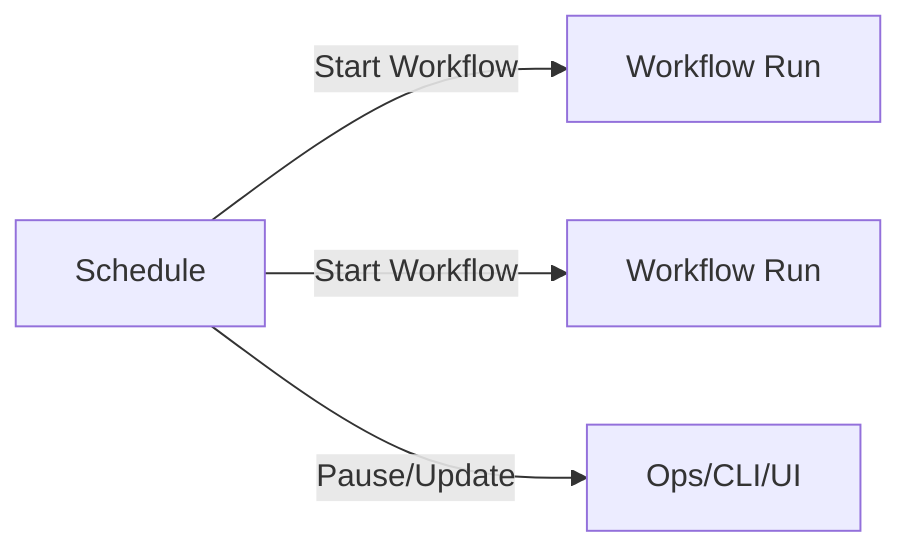
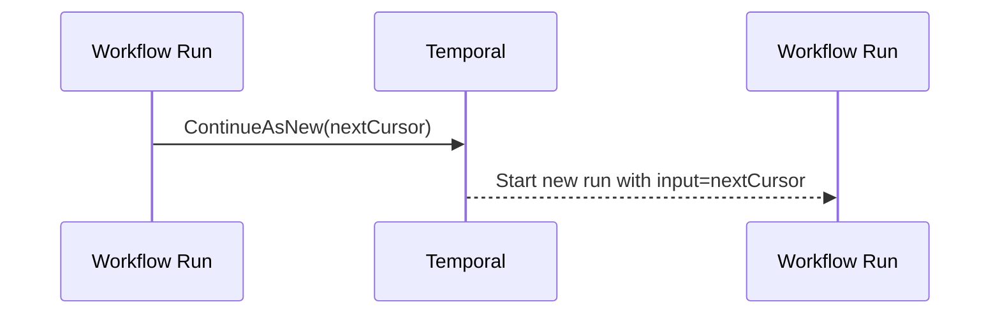

Temporal を触っていると、だんだん「定期実行」と「長時間ジョブ」が避けて通れなくなるんですよね。  
で、ここで多くの人がやりがちなのが、

- Cron っぽく動けばいいから Cron Workflow で回す
- 長い処理は 1 つの Workflow に詰め込んで延々ループ

…という “お弁当箱にカレーもラーメンも詰める” みたいな構成です。動くけど、あとで管理がつらい。

この記事では、**Schedule API** と **Continue-As-New** を軸に、定期実行と長時間ワークフローを「運用しやすい形」に落とし込む設計を整理します。最後に **大規模バッチのファンアウト・ファンイン** まで一気に繋げます。

---

## 0. 今日の地図（何をどう組み立てるか）

### まず結論の使い分け

- **定期実行のトリガは Schedule API**  
  → 「いつ起動するか」を Workflow の外に追い出す
- **長時間・大量処理の“継続”は Continue-As-New**  
  → ヒストリをリセットしながら同じ処理を進める
- **大量の対象は fan-out / fan-in（子 Workflow か Activity）**  
  → 1 本の Workflow で全部やらず、並列化と再試行の単位を整える

### たとえ話で掴むと

- Schedule API は「**マンションの管理人（起床ベル担当）**」  
  各部屋（Workflow）に毎朝起こしに行く。部屋の中は起床の責務から解放される。
- Continue-As-New は「**日記帳を新しい巻に替える**」  
  1 冊に書き続けると重くなる（ヒストリ肥大）。巻を替えて “続巻” にする。

---

## 1. Schedule API の使い方と Cron Workflow との違い

Temporal には「Cron 的に定期実行する」選択肢が複数ありますが、ここでは **Schedule API** と **Cron Workflow（WorkflowOptions の CronSchedule）** を対比します。

### 1.1 Cron Workflow の特徴（Workflow にスケジュールが埋まる）

Cron Workflow は「同じ Workflow を cron で再実行する」仕組みです。設定は簡単で、既存の Workflow をそのまま定期化できます。

ただし設計上はこうなります：

- “いつ起動するか” が **Workflow の起動オプションに埋め込まれる**
- 実行履歴や再実行の見え方が Cron の流儀になる
- 「一時停止」「バックフィル」「今すぐ 1 回だけ追加実行」といった運用操作は、Schedule API より柔軟性が落ちやすい

Cron は「古典的でわかりやすい目覚まし時計」なんですが、運用で小回りが欲しくなると途端に辛くなりがちです。

### 1.2 Schedule API の特徴（スケジュールが“資源”として独立）

Schedule API は、Temporal の中で **Schedule という独立リソース** を作り、そこから Workflow を起動します。

良いところはここです：

- スケジュールを **作成・更新・一時停止・再開** できる（Workflow とは別物）
- 「今すぐ実行」「遅延分をどう扱う」などの運用がやりやすい
- ワークフロー側は「呼ばれたら仕事する」だけに集中できる

図にするとこんな関係です。



Cron Workflow は “Workflow が目覚まし時計を内蔵”、Schedule は “マンション管理室が目覚まし業務を担当” という違いですね。

---

## 2. Schedule API（Go）実装：作成・更新・即時実行

Temporal Go SDK で Schedule を触るときは `client.ScheduleClient()` を使います（SDK のバージョンにより若干 API 名称が異なることがありますが、考え方は同じです）。

以下は「毎日 03:00 に `DailyBatchWorkflow` を起動」する例です。

### 2.1 Schedule 作成

```go
package main

import (
	"context"
	"time"

	"go.temporal.io/sdk/client"
	"go.temporal.io/sdk/temporal"
	"go.temporal.io/sdk/workflow"
)

type DailyBatchInput struct {
	Date string
}

func main() {
	ctx := context.Background()

	c, err := client.Dial(client.Options{})
	if err != nil {
		panic(err)
	}
	defer c.Close()

	sc := c.ScheduleClient()

	scheduleID := "daily-batch-0300"

	// 03:00 JST を想定（タイムゾーン運用は要件に合わせて）
	spec := client.ScheduleSpec{
		CronExpressions: []string{"0 3 * * *"},
		// Temporal 側でタイムゾーンを扱える設定がある環境では TimeZone 指定も検討
	}

	action := &client.ScheduleWorkflowAction{
		ID:        "daily-batch-" + time.Now().Format("20060102"), // 任意（衝突しない設計に）
		Workflow:  "DailyBatchWorkflow",
		TaskQueue: "batch-task-queue",
		Args:      []interface{}{DailyBatchInput{Date: time.Now().Format("2006-01-02")}},
		WorkflowExecutionTimeout: 24 * time.Hour,
		WorkflowTaskTimeout:      10 * time.Second,
		RetryPolicy: &temporal.RetryPolicy{
			InitialInterval: 1 * time.Second,
			MaximumInterval: 1 * time.Minute,
		},
	}

	schedule := client.Schedule{
		Spec: spec,
		Action: client.ScheduleAction{
			Workflow: action,
		},
		// 取りこぼし（ワーカー停止やメンテ）時の扱いをここで設計する
		Policies: &client.SchedulePolicies{
			OverlapPolicy: client.ScheduleOverlapPolicySkip, // 重複起動を避ける例
		},
	}

	_, err = sc.Create(ctx, client.ScheduleOptions{
		ID:       scheduleID,
		Schedule: schedule,
	})
	if err != nil {
		panic(err)
	}
}
```

#### OverlapPolicy の設計ポイント

ここ、地味に重要です。  
定期実行は「前回が終わってないのに次が来た」瞬間に、設計の甘さが露呈します。

- `Skip`：前回が生きていたら次回は捨てる（1 日 1 回の集計などに向きやすい）
- `BufferOne` / `BufferAll`：溜め込む（後でまとめて実行したいとき）
- `AllowAll`：並列実行（対象が独立していて安全なとき）

「レジ締め（集計）」を 2 人で同時にやると数字が壊れる、みたいなケースは `Skip` や「排他を入れた上で Buffer」が扱いやすいです。

### 2.2 Schedule の更新（起動時刻の変更など）

Schedule は “資源” なので、更新も Workflow に触らずできます。

```go
handle := sc.GetHandle(ctx, "daily-batch-0300")

err := handle.Update(ctx, func(input client.ScheduleUpdateInput) (*client.ScheduleUpdate, error) {
	s := input.Description.Schedule
	s.Spec.CronExpressions = []string{"30 2 * * *"} // 02:30 に変更

	return &client.ScheduleUpdate{
		Schedule: &s,
	}, nil
})
if err != nil {
	panic(err)
}
```

### 2.3 「今すぐ 1 回だけ」実行（手動キック）

運用で “今日だけ追加で回したい” が出ますよね。Schedule API はそこも素直です。

```go
err := handle.Trigger(ctx, client.ScheduleTriggerOptions{})
if err != nil {
	panic(err)
}
```

---

## 3. Continue-As-New：仕組みと実装パターン

### 3.1 何が問題で Continue-As-New が必要か

長時間ワークフローがつらくなる原因は主に 2 つです。

1) **Event History が増えすぎる**  
Workflow の状態遷移が積み上がり、リプレイが重くなります。  
“日記帳が分厚くなりすぎて、過去ページを毎回めくるのがしんどい” 状態。

2) **Workflow メモリに寄せすぎる**  
Workflow コード内の変数はリプレイ時に再構築されますが、設計が悪いと「巨大な状態」を抱えがちです。

Continue-As-New は、Workflow を「同じ Workflow の新しい Run として継続」し、**ヒストリをリセット**します。処理は続けつつ、重さだけをリセットするイメージです。



### 3.2 実装パターン：カーソル（ページング）で進める

バッチ処理の典型は「対象をページングして処理」です。Workflow の input に “次に処理する位置（cursor）” を持たせます。

- Input: `Cursor`, `Date`, `PageSize` など
- 1 Run で N 件処理
- 残りがあれば Continue-As-New

#### Workflow 例（Go）

```go
type BatchCursor struct {
	Date     string
	Offset   int
	PageSize int
}

func DailyBatchWorkflow(ctx workflow.Context, cur BatchCursor) error {
	logger := workflow.GetLogger(ctx)

	// 1) 対象IDを取得（Activity）
	var ids []string
	if err := workflow.ExecuteActivity(ctx, ListTargetIDsActivity, cur.Date, cur.Offset, cur.PageSize).Get(ctx, &ids); err != nil {
		return err
	}

	if len(ids) == 0 {
		logger.Info("done", "date", cur.Date)
		return nil
	}

	// 2) fan-out: 対象ごとに処理（ここでは子Workflow例）
	futures := make([]workflow.ChildWorkflowFuture, 0, len(ids))
	for _, id := range ids {
		cwo := workflow.ChildWorkflowOptions{
			WorkflowID: "daily-item-" + cur.Date + "-" + id, // 重複起動設計は要件に合わせて
			TaskQueue:  "batch-task-queue",
		}
		cctx := workflow.WithChildOptions(ctx, cwo)
		f := workflow.ExecuteChildWorkflow(cctx, ProcessOneItemWorkflow, cur.Date, id)
		futures = append(futures, f)
	}

	// 3) fan-in: 全部待つ
	for _, f := range futures {
		if err := f.Get(ctx, nil); err != nil {
			return err
		}
	}

	// 4) 次ページへ。ヒストリ肥大を避けるため Continue-As-New
	next := cur
	next.Offset += len(ids)

	// ここが “日記帳の巻替え”
	return workflow.NewContinueAsNewError(ctx, DailyBatchWorkflow, next)
}
```

ポイントは「**1 Run の作業量を制限**」することです。  
Continue-As-New なしで 100 万件を 1 Run で回すと、後半はリプレイが重くて “朝の通勤ラッシュなのに改札が 1 台” みたいになります。

---

## 4. 大規模バッチ処理：ファンアウト・ファンイン設計

ここは設計判断の話が中心です。

### 4.1 fan-out の単位：Activity か 子 Workflow か

- **Activity fan-out**  
  - 軽い処理、短時間、リトライ戦略が単純
  - ワークフロー側のヒストリ増加に注意（大量の Activity 完了イベントが積み上がる）
- **子 Workflow fan-out**  
  - 1 件が重い、処理の途中経過や再開が欲しい、個別に観測したい
  - 1 件ごとに “小さな状態機械” を持てる

ざっくり「**対象 1 件が独立したストーリーを持つなら子 Workflow**」が扱いやすいですよね。

### 4.2 同時実行数（並列度）の制御

fan-out はやりすぎると外部 API や DB を殴りすぎます。  
Temporal は “雑に並列化しても壊れにくい” ですが、周りの世界はそうでもない。

制御の方法は主に 2 つです：

- **Workflow 側でセマフォ的に制限**（バッチの中で N 個ずつ待つ）
- **Worker の concurrency 設定で制限**（TaskQueue 全体として上限を作る）

Workflow 側で N 個ずつ処理する例（子 Workflow でも Activity でも同じ形です）：

```go
const parallelism = 50

for i := 0; i < len(ids); i += parallelism {
	end := i + parallelism
	if end > len(ids) {
		end = len(ids)
	}

	var fs []workflow.ChildWorkflowFuture
	for _, id := range ids[i:end] {
		f := workflow.ExecuteChildWorkflow(ctx, ProcessOneItemWorkflow, cur.Date, id)
		fs = append(fs, f)
	}
	for _, f := range fs {
		if err := f.Get(ctx, nil); err != nil {
			return err
		}
	}
}
```

“50 人ずつ会議室に入れて、終わったら次の 50 人” 方式ですね。会議室（DB）を破壊しない。

### 4.3 失敗の扱い：どこで止め、どこで続けるか

バッチは「1 件失敗したら全部やり直し」だと運用が地獄になりがちです。

よくある設計は：

- 子 Workflow はその件をリトライし、それでもダメなら「失敗として確定」し結果を記録
- 親 Workflow は “全体として完走” を優先し、失敗件数を集計して最後に通知

このとき「結果の集計」は Workflow のメモリに溜め込みすぎないのがコツで、**外部ストレージに逐次書く**（Activity で書く）か、**カウントだけ持つ**などにします。

---

## 5. 長時間ワークフローのメモリ・ヒストリ管理

長時間運用で効いてくるのはここです。地味ですが、効きます。

### 5.1 ヒストリを増やす要因

- Activity/ChildWorkflow を大量に起動・完了
- Signal を大量に受ける
- Timer を細かく刻みすぎる
- `workflow.Sleep` の多用（ユースケース次第）

対策の基本が **Continue-As-New** です。  
「何イベント溜まったら巻替えするか」はワークロード次第ですが、考え方としては：

- “1 Run が処理する対象数” を制限する（ページング）
- “一定時間ごとに Continue-As-New” を入れる（例えば数時間単位）
- Signals を溜め続けるタイプは、処理済みカーソルを input に持ち替える

### 5.2 メモリ（Workflow state）を太らせない

Workflow は “状態を保持できる” のが魅力ですが、**保持しなくていいものは保持しない** のが長期戦のコツです。

- 巨大な配列（全 ID 一覧など）を Workflow に載せない  
  → 取得はページングで。必要なら外部 DB に置く
- 中間結果の全文を溜めない  
  → 逐次書き込み（Activity）＋参照キーだけ保持
- ローカルキャッシュ的なものを作らない  
  → リプレイで意味が薄いことが多い

Workflow は “台帳係” で、重い荷物を運ぶのは倉庫（DB）と作業員（Activity/子 Workflow）に任せるのがきれいです。

---

## 6. Schedule × Continue-As-New：定期バッチの黄金パターン

ここまでを組み合わせると、定期バッチはこうなります。

```mermaid
flowchart TD
  SCH[Schedule: 03:00] --> WF[DailyBatchWorkflow (page cursor)]
  WF -->|Child WF fan-out| C1[ProcessOneItemWorkflow]
  WF -->|Child WF fan-out| C2[ProcessOneItemWorkflow]
  WF -->|Continue-As-New| WF
```

- Schedule は「今日のバッチを起動する」だけ
- バッチ Workflow は「ページングしながら fan-out し、巻替えしつつ完走する」

こうすると、運用面で嬉しいことが増えます。

- 03:00 の起動時刻変更は Schedule 更新で完結
- バッチが長引いても Continue-As-New でヒストリが膨れにくい
- 対象 1 件の失敗を子 Workflow 単位で扱える

---

## 7. 実践ミニ構成：DailyBatch + ProcessOneItem

最後に、子 Workflow 側の最小例を置いておきます。  
「1 件処理」を子 Workflow にすることで、個別にリトライやタイムアウトを設計できます。

```go
func ProcessOneItemWorkflow(ctx workflow.Context, date string, id string) error {
	ao := workflow.ActivityOptions{
		StartToCloseTimeout: 2 * time.Minute,
		RetryPolicy: &temporal.RetryPolicy{
			InitialInterval: 2 * time.Second,
			MaximumInterval: 30 * time.Second,
		},
	}
	ctx = workflow.WithActivityOptions(ctx, ao)

	// 例: 外部API呼び出し→DB更新、みたいな処理
	if err := workflow.ExecuteActivity(ctx, ProcessOneItemActivity, date, id).Get(ctx, nil); err != nil {
		return err
	}
	return nil
}
```

親側が Continue-As-New で巻替えしても、子 Workflow の実行は個別に観測できます。  
「バッチ全体の進捗」と「個別アイテムの物語」を分離できるのが強いんですよね。

---

## 8. まとめ（設計の芯）

- 定期実行は **Schedule API** で “いつ起動するか” を Workflow から分離すると運用が楽です
- 長時間ワークフローは **Continue-As-New** を前提に “巻替えできる形（カーソル設計）” にします
- 大規模バッチは **fan-out / fan-in** で分割し、並列度と失敗の扱いを設計で決めます
- ヒストリとメモリは “太らせない” が長期戦のコツ。Workflow は台帳係に徹させましょう

---

## 次回予告（応用編 #5）

次は、Temporal を本番で回す上で避けられない **バージョニング（Workflow の進化）** と **運用・可観測性** に寄せて、「壊さずに変える」話をします。  
“飛行中の飛行機を分解整備する” みたいな世界を、ちゃんと地に足つけてやっていきましょう。