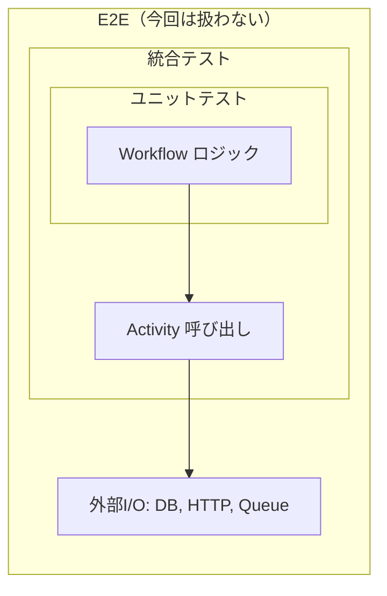
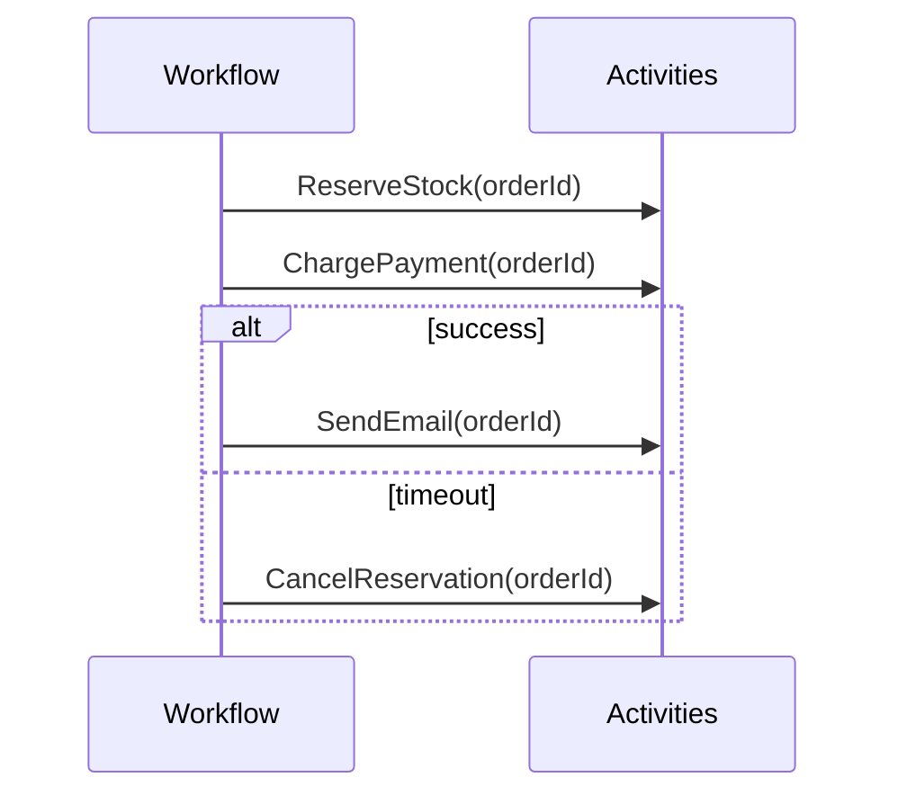
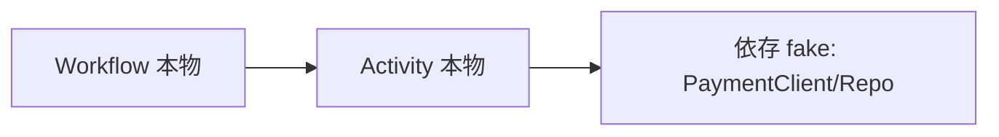

Temporal のテストって、最初は「分散システムの実行環境をテストで再現するの無理では…？」って気持ちになりますよね。  
でも Temporal はそこをかなり現実的にしてくれていて、**Workflow を「決定論のプログラム」としてユニットテスト**できるように設計されています。

この回では、Go SDK の `testsuite` を軸にして、**Workflow / Activity を速く・安定して・設計意図が伝わる形で**テストする戦略を整理します。

---

## この回で狙うテストの「配置図」

Temporal のテストは、ざっくり「どの箱を本物にするか」の話なんですよね。お弁当で言うと、全部手作り（E2E）にすると重い。冷凍食品（モック）を混ぜると早い。どこまで手作りにするかのバランスが大事、というやつです。



- **Workflow ユニットテスト**: Activity はモック。Workflow の分岐・リトライ・タイマーなどの「制御」を検証
- **Activity ユニットテスト**: 依存（DB/HTTP など）を差し替えて Activity の「I/O と変換」を検証
- **統合テスト**: Temporal の in-memory 環境で Workflow + Activity をつないで、結線ミスやシリアライズを検証

---

## `testsuite` パッケージの使い方（Go）

Go SDK だと `go.temporal.io/sdk/testsuite` が中核です。ポイントは次の2つです。

- **WorkflowEnvironment**（ワークフロー用）: `ExecuteWorkflow` で Workflow を動かし、Activity を差し替えたり、時間を進めたりできます
- **ActivityEnvironment**（アクティビティ用）: Activity 単体を、テスト向けの Context と依存差し替えで実行できます

最小の骨格はこんな感じです。

```go
import (
  "testing"

  "github.com/stretchr/testify/require"
  "go.temporal.io/sdk/testsuite"
)

type UnitTestSuite struct {
  testsuite.WorkflowTestSuite
  env *testsuite.TestWorkflowEnvironment
}

func (s *UnitTestSuite) SetupTest() {
  s.env = s.NewTestWorkflowEnvironment()
}

func Test_Something(t *testing.T) {
  var ts UnitTestSuite
  ts.SetupTest()

  // ts.env.ExecuteWorkflow(...)
  // require.NoError(t, ts.env.GetWorkflowError())
}
```

`stretchr/testify/suite` を使って suite 化する人も多いですが、記事では説明を単純にするために「素のテスト + env」を軸に進めますね。

---

## サンプル: 「注文確定」Workflow を題材にする

以降の例は、次のような典型構成を題材にします。

- `ReserveStock`（在庫引当 Activity）
- `ChargePayment`（決済 Activity）
- `SendEmail`（通知 Activity）
- 一定時間決済が完了しない場合はキャンセル（タイマー）



Workflow の実装（雰囲気）はこんな感じにします。

```go
type Activities struct{}

func OrderWorkflow(ctx workflow.Context, orderID string) error {
  ao := workflow.ActivityOptions{
    StartToCloseTimeout: 30 * time.Second,
    RetryPolicy: &temporal.RetryPolicy{
      InitialInterval: 200 * time.Millisecond,
      MaximumAttempts: 3,
    },
  }
  ctx = workflow.WithActivityOptions(ctx, ao)

  if err := workflow.ExecuteActivity(ctx, (*Activities).ReserveStock, orderID).Get(ctx, nil); err != nil {
    return err
  }

  // 決済はタイムアウトを短く別設定にする、みたいな現場あるある
  payCtx := workflow.WithActivityOptions(ctx, workflow.ActivityOptions{
    StartToCloseTimeout: 10 * time.Second,
  })

  if err := workflow.ExecuteActivity(payCtx, (*Activities).ChargePayment, orderID).Get(ctx, nil); err != nil {
    // 決済失敗時は在庫引当を戻す
    _ = workflow.ExecuteActivity(ctx, (*Activities).CancelReservation, orderID).Get(ctx, nil)
    return err
  }

  // 少し待ってから通知（例: 下流の整合性待ち）
  _ = workflow.Sleep(ctx, 5*time.Minute)

  return workflow.ExecuteActivity(ctx, (*Activities).SendEmail, orderID).Get(ctx, nil)
}
```

---

## Workflow のユニットテスト：Activity をモックして分岐を検証する

### ねらい

Workflow テストで一番価値が出るのは、

- 分岐（成功/失敗/タイムアウト）
- リトライの挙動
- タイマーやシグナル待ち
- Activity 呼び出し順序・回数
- エラーの握り方（補償処理を含む）

…このあたりの **「制御プレーン」** です。  
DB や HTTP の中身は Activity テストに寄せて、ここでは「Activity がこう返したらどうなる？」を高速に回します。

### モックの方法（`OnActivity`）

`testsuite.TestWorkflowEnvironment` は Activity をモックできます。Go の場合は `OnActivity` で期待と戻り値を定義します。

```go
func Test_OrderWorkflow_Success(t *testing.T) {
  var ts testsuite.WorkflowTestSuite
  env := ts.NewTestWorkflowEnvironment()

  env.RegisterWorkflow(OrderWorkflow)

  // Activity モック
  env.OnActivity((*Activities).ReserveStock, mock.Anything, "o-1").Return(nil)
  env.OnActivity((*Activities).ChargePayment, mock.Anything, "o-1").Return(nil)
  env.OnActivity((*Activities).SendEmail, mock.Anything, "o-1").Return(nil)

  env.ExecuteWorkflow(OrderWorkflow, "o-1")

  require.True(t, env.IsWorkflowCompleted())
  require.NoError(t, env.GetWorkflowError())

  env.AssertExpectations(t)
}
```

ここでのコツは、

- **Workflow に渡る第1引数は `context.Context` ではなく workflow 内部のもの**なので `mock.Anything` にしておく
- 「期待している Activity が呼ばれたか」を `AssertExpectations` で確認する

というあたりです。

### 失敗時の補償（CancelReservation）が動くか

「決済が失敗したら引当を戻す」が本体のロジックなので、ここをテストします。

```go
func Test_OrderWorkflow_PaymentFails_ThenCancelReservation(t *testing.T) {
  var ts testsuite.WorkflowTestSuite
  env := ts.NewTestWorkflowEnvironment()

  env.RegisterWorkflow(OrderWorkflow)

  env.OnActivity((*Activities).ReserveStock, mock.Anything, "o-1").Return(nil)
  env.OnActivity((*Activities).ChargePayment, mock.Anything, "o-1").
    Return(temporal.NewApplicationError("declined", "PaymentDeclined"))
  env.OnActivity((*Activities).CancelReservation, mock.Anything, "o-1").Return(nil)

  env.ExecuteWorkflow(OrderWorkflow, "o-1")

  require.True(t, env.IsWorkflowCompleted())
  require.Error(t, env.GetWorkflowError())

  env.AssertExpectations(t)
}
```

「補償の Activity が呼ばれている」ことが、このテストの主題になります。

---

## Activity のモックと差し替え：どこで何をモックするか

ちょっとややこしいのは、「Activity をモックする」の意味が2種類あることなんですよね。

- **Workflow テストにおける Activity のモック**: `env.OnActivity(...)`
- **Activity 自体のテストにおける依存の差し替え**: HTTP クライアント、DB、SDK などを fake/mock にする

これ、レイヤが違います。  
前者は「料理長（Workflow）が何を指示したか」を見るテストで、後者は「調理人（Activity）がちゃんと調理できるか」を見るテスト、という分担です。

---

## Activity のユニットテスト：`ActivityTestSuite` と依存の差し替え

Activity は普通の Go 関数に近いので、依存を注入できる形にしておくとテストが楽です。

例として、決済 Activity が `PaymentClient` に依存しているとします。

```go
type PaymentClient interface {
  Charge(ctx context.Context, orderID string) error
}

type Activities struct {
  Payment PaymentClient
}

func (a *Activities) ChargePayment(ctx context.Context, orderID string) error {
  return a.Payment.Charge(ctx, orderID)
}
```

これを `testsuite.ActivityTestSuite` で実行します。

```go
func Test_ChargePaymentActivity(t *testing.T) {
  var ts testsuite.WorkflowTestSuite
  env := ts.NewTestActivityEnvironment()

  pc := new(MockPaymentClient)
  pc.On("Charge", mock.Anything, "o-1").Return(nil)

  acts := &Activities{Payment: pc}
  env.RegisterActivity(acts)

  _, err := env.ExecuteActivity(acts.ChargePayment, "o-1")
  require.NoError(t, err)

  pc.AssertExpectations(t)
}
```

ここでの設計判断としては、

- Activity は「外部 I/O + 変換 + エラー分類」を担当しがち
- Workflow は「状態遷移・リトライ・補償・タイム」の制御に集中させたい

という分業が、テスト容易性に直結します。

---

## テスト時の時間制御：タイマー・スリープをスキップする

Temporal の良さの一つがここで、**テスト環境では時間をワープできます**。  
Workflow の `Sleep` や timer は、`testsuite` 上だと「仮想時間」で進むため、5分待ちを実時間で待たなくて済みます。

さっきの `workflow.Sleep(ctx, 5*time.Minute)` がある Workflow をテストしても、普通に完了します。

```go
func Test_OrderWorkflow_SleepIsSkipped(t *testing.T) {
  var ts testsuite.WorkflowTestSuite
  env := ts.NewTestWorkflowEnvironment()

  env.RegisterWorkflow(OrderWorkflow)

  env.OnActivity((*Activities).ReserveStock, mock.Anything, "o-1").Return(nil)
  env.OnActivity((*Activities).ChargePayment, mock.Anything, "o-1").Return(nil)
  env.OnActivity((*Activities).SendEmail, mock.Anything, "o-1").Return(nil)

  env.ExecuteWorkflow(OrderWorkflow, "o-1")

  require.NoError(t, env.GetWorkflowError())
}
```

感覚としては「Workflow の中の時計だけ、早送りリモコンが付いている」感じですね。  
分散システムで「時間」が絡むテストが重くなるのは定番なんですが、Temporal はそこをかなり救ってくれます。

---

## 統合テストの設計パターン：in-memory で “結線” を検証する

ユニットテストが揃っていても、以下はすり抜けがちです。

- Activity 名の登録ミス（メソッドレシーバの違いなど）
- 引数/戻り値のシリアライズでコケる
- リトライポリシーやタイムアウトの実設定ミス
- インターセプタやコンテキスト伝播の取りこぼし

そこで「Workflow + 本物 Activity（ただし外部依存は fake）」をまとめて回す **統合テスト** を作ります。  
ポイントは **I/O の外側（DB/HTTP）はまだ本物にしない** ところです。テストの責務がブレます。

### パターンA: Activity は本物、外部依存は fake



実装例（イメージ）:

```go
func Test_OrderWorkflow_Integration(t *testing.T) {
  var ts testsuite.WorkflowTestSuite
  env := ts.NewTestWorkflowEnvironment()

  // fake 依存
  pc := new(MockPaymentClient)
  pc.On("Charge", mock.Anything, "o-1").Return(nil)

  acts := &Activities{Payment: pc}

  env.RegisterWorkflow(OrderWorkflow)
  env.RegisterActivity(acts)

  // ここでは OnActivity で潰さず、本物 Activity を走らせる
  // ReserveStock/SendEmail も同様に依存を fake にした本物で用意すると良い

  env.ExecuteWorkflow(OrderWorkflow, "o-1")
  require.NoError(t, env.GetWorkflowError())
}
```

この統合テストがあると、「モックでは通ってたのに登録の仕方が違って落ちる」みたいな事故が減ります。  
Workflow と Activity の“プラグの形”が合っているかを見るテストですね。

### パターンB: エラー分類の接続を検証する

Activity が返すエラーは、Workflow の分岐条件に直結します。たとえば、

- リトライしたいエラー（ネットワーク）
- リトライ不要の業務エラー（決済拒否）

を `temporal.ApplicationError` の type で分類し、Workflow 側がそれを見て動作を変える、という設計にしている場合。

この接続は、ユニットテスト（OnActivity で ApplicationError を返す）でも確認できますが、統合テストで「Activity の実装が正しい type を付けてるか」まで押さえると堅くなります。

---

## ちょいコツ集（ハマりどころを先回り）

### 1) Workflow テストは「状態」より「イベント」を見た方が強い
Temporal の Workflow はイベント履歴で進むので、テストも

- どの Activity を呼んだか
- 何回呼んだか
- 失敗したときに補償が入ったか

みたいな「イベント観測」に寄せると、変更に強くなります。

### 2) Activity の引数はなるべく “小さく、明示的に”
巨大な struct を渡すと、シリアライズ互換やフィールド追加でテストが壊れやすいです。  
「注文ID」「金額」などの意味がはっきりした入出力にしておくと、ユニットテストの意図も読みやすくなります。

### 3) テストは「どの層の話か」をコメントに書く
特に Temporal は「Workflow のテストで Activity をモックする」が自然なので、統合テストで本物 Activity を走らせていると混乱が起きやすいです。  
`// integration: workflow + real activities (deps faked)` みたいな一言が効きます。

---

## まとめ：おすすめのテスト配分

- **Workflow ユニットテスト（最優先）**  
  `testsuite.TestWorkflowEnvironment` + `OnActivity` で分岐・補償・タイマーを高速に検証
- **Activity ユニットテスト（次点）**  
  `NewTestActivityEnvironment` + 依存差し替えで I/O とエラー分類を検証
- **統合テスト（要所）**  
  Workflow + 本物 Activity をつなぎ、登録・シリアライズ・設定ミスを拾う（外部I/Oは fake のまま）

次回（応用編 #3）では、Temporal を長く運用していると避けて通れない **バージョニング（Workflow の互換性）** を扱う予定です。テスト戦略と組み合わせると、リリースがかなり安心になりますよ。