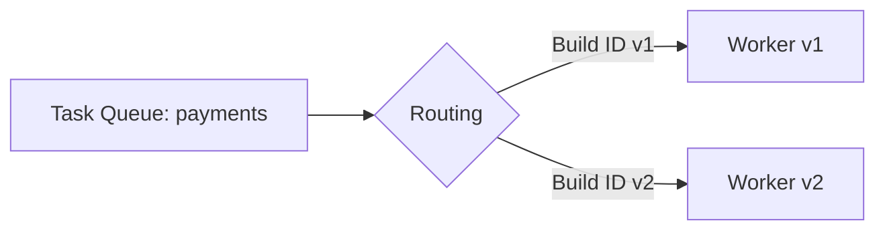
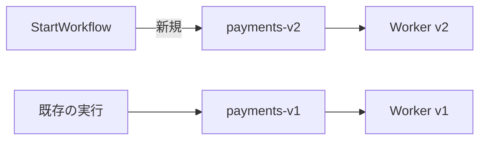

Temporal のバージョニングって、分散システム界の「引っ越しあるある」なんですよね。  
住人（実行中 Workflow）がまだ旧居にいるのに、大家（コード）だけ先に新居仕様に変わると、ドアの位置がズレて「入れない」みたいなことが起きます。

Temporal ではそれが **Determinism（決定性）制約**として現れて、ここを理解するとデプロイ戦略が一気に腹落ちします。今回は **Workflow を安全に進化させるための道具箱**として、

- Determinism 制約とその理由
- `GetVersion` によるワークフロー内バージョニング
- Worker Versioning（Build ID ベース）
- Task Queue 分離によるデプロイ
- ローリングデプロイの実戦的な勘所

をまとめます。

---

## 1. Determinism 制約：なぜ「同じ履歴から同じ結果」が必要か

Temporal の Workflow は「今この瞬間のコード」を実行しているように見えて、実態は **History（イベント履歴）をリプレイ**して状態を復元しながら進みます。

つまり Workflow はこういうモデルです：

```text
History(過去の出来事ログ) + Workflowコード(解釈器) => 現在の状態
```

ここでコードが変わると、同じ履歴を読んでも別の分岐を選んでしまうことがあります。すると Temporal は「履歴に書いてあること」と「コードが今やろうとしていること」が食い違い、**Non-deterministic error** になります。

### イメージ図：リプレイは「録画の再生」

Temporal のリプレイは、ライブ配信じゃなくて録画再生に近いです。


録画を再生してるのに、途中から脚本（コード）を差し替えたら、俳優が急に別のセリフ言い出して整合しない…みたいな感じですね。

### Determinism を壊しやすい変更例

- 条件分岐の追加・削除（`if` の条件や順序変更）
- `selector` / 並行処理の組み立てが変わる
- ループ回数や Activity 呼び出し順が変わる
- Workflow 内で `time.Now()` や乱数、外部 I/O を使う  
  （Workflow は純粋関数っぽく振る舞う必要がある、という話ですね）

---

## 2. `GetVersion`：Workflow 内に「分岐の栞」を挟む

じゃあコードはどうやって進化させるの？というと、Temporal の定番が **`GetVersion` API** です。これは「この分岐点は v1 と v2 のどっちで動くべきか」を **History に刻む**ための仕掛けです。

たとえ話をすると、`GetVersion` は「この交差点に交通標識を設置して、昔から走ってる車は旧ルート、新しい車は新ルートに誘導する」みたいなものです。

### 基本パターン（Go）

```go
const changeID = "calc-fee-v2"

func Workflow(ctx workflow.Context, input Input) error {
    v := workflow.GetVersion(ctx, changeID, workflow.DefaultVersion, 2)

    var fee int
    if v == workflow.DefaultVersion {
        fee = legacyFee(input)
    } else {
        fee = newFee(input)
    }

    // 以降の処理…
    return nil
}
```

ポイントは：

- `changeID` は「分岐点の名前」。運用上はリネームしない方が扱いやすいです
- `GetVersion` の結果は History に記録されるので、リプレイでも同じ値が返り続けます
- 既存実行は `DefaultVersion` 側へ、新規実行は新バージョン側へ誘導できます（設定した maxVersion による）

### いつ `GetVersion` を置く？

「履歴と将来のコード差分が出る地点」に置きます。

- Activity 呼び出し順を変える前
- 分岐条件を変える前
- タイマーや child workflow の作り方を変える前

`GetVersion` を置く場所は、道路工事でいう「交通規制の看板を置く場所」なので、工事区間の手前に置くのがコツです。

### バージョンの“撤去”（分岐を消す）タイミング

しばらく運用すると「旧ルート（DefaultVersion）を通っている実行」が消えていきます。  
その状態になってから、旧分岐を削除してコードを整理します。

実務では「旧実行が残ってない」をどう判断するかが重要で、後述する **Build ID / Task Queue 分離**と組み合わせると管理しやすいです。

---

## 3. Worker Versioning（Build ID ベース）：実行中 Workflow を“担当替え”する

`GetVersion` はワークフロー内の分岐管理。  
一方 **Worker Versioning** は「どの Worker がどの Workflow Task を処理するか」を制御する仕組みです。

Build ID を使うと、同じ Task Queue 上でも

- v1 の Worker が処理する実行
- v2 の Worker が処理する実行

をサーバ側のルーティングで分けられます。

### どう嬉しい？

たとえば「古い実行は v1 バイナリで最後まで面倒を見る」「新規だけ v2 に流す」がやりやすくなります。  
`GetVersion` でも似たことは可能ですが、Build ID は **コードの責務分離**が明確で、デプロイの安全弁として強いです。

### イメージ：同じ窓口、担当者を分ける



窓口（Task Queue）は同じだけど、受付の担当者（Worker）を「旧担当」「新担当」に分ける感じですね。

### 使いどころの目安

- 大きめの互換性変更を入れる
- `GetVersion` の分岐が増えすぎて読みづらい
- 段階的に新 Worker へ切り替えたい（新規だけ、まず 10%、など）

（設定・運用手順の細部は環境によって変わるので、ここでは概念と戦略に絞りますね。）

---

## 4. Task Queue 分離：いちばん分かりやすい“引っ越し”戦略

**Task Queue を分ける**のは、Temporal のデプロイ戦略としてかなり直球で、理解もしやすいです。

- `payments-v1`（旧）
- `payments-v2`（新）

みたいに分けて、新規開始は v2 に、旧実行は v1 のまま流し続けます。

### イメージ：新店舗を隣に建てて、客を誘導する



お店の内装を改装しながら営業すると事故りがちなので、隣に新店舗を作って客を徐々に誘導する、あれです。

### Task Queue 分離のメリット/デメリット

**メリット**
- 旧実行と新実行が混線しにくい
- ロールバックが単純（新規の入り口を戻すだけ）
- 「旧が残っているか」が観測しやすい（Queue の滞留・実行数）

**デメリット**
- 運用対象（Queue/Worker）が増える
- ルーティング（どの Workflow をどっちで開始するか）をアプリ側で持つ必要が出る

---

## 5. ローリングデプロイのベストプラクティス（Temporal 版）

Temporal のローリングデプロイは、Web API のそれと違って「リクエストが数秒で終わる」前提が崩れます。  
Workflow は長生きなので、「新旧が同時に走る期間」を前提に設計するのがコツです。

### 5.1 基本方針：互換期間を作る

デプロイで意識する互換性は主に 2 つです。

- **Workflow コードの決定性互換**（History リプレイで壊れない）
- **Activity/外部 API の互換**（入力・出力スキーマの両対応）

特に Activity の入出力変更は「先に受け口を広げてから、送る側を変える」が安全です。  
分散システムの定番の段階移行ですね。

### 5.2 実戦的な手順（推奨の型）

代表的な「事故りにくい順序」を書くと、こうなります。

#### パターンA：`GetVersion` で段階移行（同一 Task Queue）
1. 新コードをデプロイ（`GetVersion` で新旧分岐を持つ）
2. 新規実行が新経路に入る
3. 旧経路の実行が自然に減る（観測する）
4. 旧経路が消えてから分岐を削除

#### パターンB：Task Queue 分離（新旧を物理的に分ける）
1. `payments-v2` を用意して v2 Worker をデプロイ
2. 新規開始だけ v2 Queue に切り替え
3. v1 の実行が尽きるまで v1 Worker を維持
4. v1 を停止・撤去

#### パターンC：Worker Versioning（Build ID）でルーティング
1. v2 Worker を Build ID 付きで追加
2. サーバ側のルーティングで新規を v2 に寄せる
3. 旧実行の収束を観測
4. v1 の割当を縮退

チームの成熟度的には、まず Task Queue 分離が分かりやすく、その後 Build ID に寄せていくケースが多い印象です。

### 5.3 ロールバック戦略を先に決める

Temporal で怖いのは「デプロイしてから問題に気づいたが、実行中 Workflow が新コード前提で進んでしまった」ケースです。

- Task Queue 分離：新規開始先を戻す、がやりやすい
- Build ID：ルーティングを戻す、がやりやすい
- `GetVersion`：分岐設計による（新経路に入った実行を旧コードで扱えるかは要検討）

なので、機能フラグ的に入口を切り替えられる設計（StartWorkflow のルーティング）を用意しておくと安心感が増します。

---

## 6. まとめ：どれを選ぶ？（設計判断の早見表）

最後に、判断を表にしておきますね。

| 手法 | 何を守る？ | 強い場面 | 代償 |
|---|---|---|---|
| `GetVersion` | 決定性（History とコードの整合） | Workflow の進化（分岐追加・順序変更） | 分岐が増えると読みづらい |
| Worker Versioning（Build ID） | 実行の担当 Worker | 新旧 Worker の共存、段階切替 | 運用・ルーティング設計が必要 |
| Task Queue 分離 | 実行の住み分け | 大きな変更、切戻し重視 | Queue/Worker が増える |

個人的な感覚としては、

- 小〜中変更：`GetVersion` を基本にする
- 大変更：Task Queue 分離 or Build ID を併用する
- 長寿命 Workflow：新旧共存期間が長い前提で、分離戦略を厚めにする

あたりが扱いやすいです。

---

次回（#4）は、こういうバージョニング戦略を支える「テスト戦略（リプレイ・リグレッション・統合テスト）」を、実務目線でまとめます。Workflow の変更を怖くしない土台づくり、やっていきましょう。