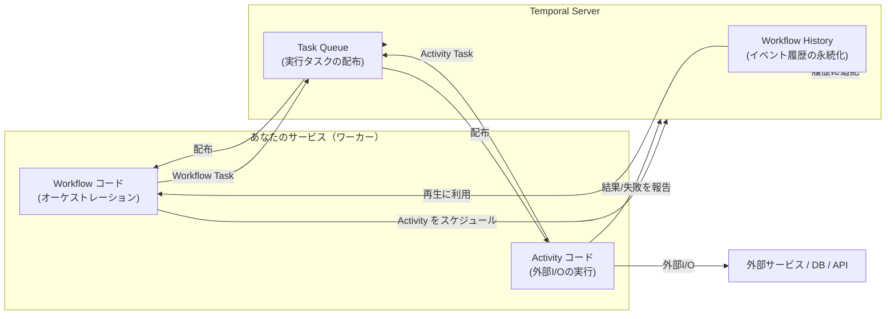

分散システムで「複数サービスにまたがる処理（例: 注文→決済→在庫→発送）」を実装すると、ユースケース自体は単純でも運用上の難しさが急に増えます。  
本記事では、その難しさがどこから来るのかを整理し、Temporal が提示する **Durable Execution** というアプローチの全体像をつかみます。

> 本シリーズ（基本編）は概念中心です。SDK の使い方や詳細実装は扱いません。

---

## 1. 典型的な分散システムの課題

### 1.1 部分障害（Partial Failure）が「普通に起きる」

単一プロセスの処理なら、失敗は「失敗」で終わります。しかし分散システムでは、処理の途中で次のような状況が混ざります。

- リクエストは送れたがレスポンスが返らない（タイムアウト）
- 相手は処理を完了しているが、こちらは失敗だと思っている
- 途中のサービスだけ落ちている（他は生きている）
- ネットワーク断・一時的な過負荷が断続的に発生する

つまり「成功 / 失敗」の二値で語れず、**成功したかどうかが観測できない**瞬間が挟まります。これが後述の冪等性や補償設計を難しくします。

---

### 1.2 冪等性（Idempotency）を要求される

分散システムではリトライが前提になります。すると同じ操作が複数回実行される可能性があります。

- クライアントがタイムアウトして再送
- ワーカーが落ちて再実行
- キューが再配送する（可視性タイムアウト切れ等）

例: 決済 API を 2 回叩いたら二重課金、在庫引当が 2 回走ったら在庫が崩れる。

そのため、以下がセットで必要になります。

- **操作の冪等化**（冪等キー、重複排除、状態遷移のガード）
- **リトライ方針**（回数・間隔・指数バックオフ・上限）
- **重複実行時の整合性**（DB 制約、ロック、Outbox など）

これらをサービスごとに積み上げると、実装が分散し、全体の見通しが悪くなります。

---

### 1.3 補償トランザクション（Compensation）の設計が避けられない

分散環境では、複数サービスに跨る処理を「ACIDトランザクション」一発でまとめるのは難しいことが多いです。そこで「途中まで進んだら巻き戻す」ための **補償** を設計します（Saga パターンの文脈）。

例（注文フロー）:

1. 在庫を引当
2. 決済を確定
3. 発送依頼

もし 3 が失敗したら、2 を取り消し（返金）、1 を解除（在庫戻し）…といった補償が必要です。

しかし補償は「逆操作」では済みません。

- 返金は即時でなく非同期かもしれない
- 期限切れ、部分返金、手数料などドメインルールが絡む
- 補償自体も失敗するので、補償のリトライやエスカレーションが要る

結果として、**例外系が主役**になっていきます。

---

## 2. メッセージキューベースのアーキテクチャの限界

キュー（Pub/Sub、RabbitMQ、SQS、Kafka など）を使うと、疎結合・非同期化・平準化はしやすくなります。一方で、**「ワークフロー（複数ステップの長い処理）」そのもの**を安定運用するには別の難しさが出ます。

### 2.1 キューは「状態機械」を提供しない

キューは基本的に「メッセージを届ける」仕組みで、次の問いには答えてくれません。

- いま全体フローはどのステップにいるか
- どこで何回リトライしたか
- 次にいつ再試行されるか
- タイムアウトしたので補償に移るべきか
- 人手対応が必要なケースはどれか

結局、アプリ側に「状態管理テーブル」「タイマー」「リトライ管理」「監視 UI」を実装することになります。

---

### 2.2 「少なくとも一回配送」と冪等の責任がアプリ側に来る

多くのキューは at-least-once であり、重複は起こり得ます。  
重複排除はワーカー実装側に寄っていきます。

- 冪等キーをどう生成するか
- どこに重複を記録するか（DB/キャッシュ）
- どの単位で一意性を担保するか

これがサービスごとに異なる流儀で実装され、横断的な運用が難しくなります。

---

### 2.3 長い処理（数分〜数日）に対するタイマーや再開がつらい

例えば「30分後に再試行」「2日待って反応がなければキャンセル」などは頻出です。キュー単体だと以下を別途用意する必要が出ます。

- 遅延実行（Delay Queue / Scheduled message）
- スケジューラ
- ワーカーの再起動やデプロイを跨いだ継続
- タイムアウト後の遷移（補償へ）

「いつ・なにを・なぜ」実行するかの履歴が散らばりやすく、障害時の調査コストが増えます。

---

### 2.4 観測性（可視化）の不足を埋めるための追加実装が増える

キューとワーカーの組み合わせでは、ワークフロー全体を追うために次が必要になりがちです。

- 相関IDの付与・伝播
- ステップごとのログ整備
- 状態遷移の永続化
- リトライ回数・デッドレター・手動復旧の運用手順

「処理を動かす」以外のコードと運用が肥大化します。

---

## 3. Temporal のアプローチと全体像

Temporal は、ワークフロー（長期実行・複数ステップ・エラー前提）を **プログラマブルに管理するための基盤**です。メッセージ配送ではなく、**状態・履歴・リトライ・タイムアウトを含めた“実行そのもの”**を扱います。

### 3.1 Temporal が提供する中心コンセプト

- **Workflow**: 長いビジネスプロセスを表す（状態機械の本体）
- **Activity**: 外部世界（DB、HTTP、他サービス）へ副作用を起こす処理単位
- **Temporal Server**: ワークフローの履歴を永続化し、スケジューリングする
- **Worker**: Workflow/Activity のコードを実行するプロセス

ポイントは、Workflow が「いまどこまで進んだか」を **履歴（History）として蓄え**、ワーカーが落ちても **続きから**進めることです。

---

### 3.2 全体像（図解）

ここで重要なのは、Temporal Server が **「何が起きたか」**を履歴として保持し、それを使って Workflow を再構築できる点です。

---

## 4. Durable Execution とは何か

Temporal のキーワードとしてよく出るのが **Durable Execution** です。  
これは一言で言うと、

- 「長い処理を、プロセスの寿命や一時障害から独立させて継続できる」  
- 「失敗・リトライ・待機・タイムアウトを、実行基盤が一貫して管理できる」

という性質です。

### 4.1 “実行”を永続化する：履歴駆動（Event History）

Temporal は、Workflow の進行を「イベントの列」として保存します。例:

- WorkflowStarted
- ActivityScheduled
- ActivityStarted
- ActivityFailed（リトライ予定）
- TimerStarted（30分待つ）
- TimerFired
- ActivityCompleted
- WorkflowCompleted

ワーカーが落ちても、履歴が残っているので、別のワーカーが再び Workflow を動かせます。  
このとき Workflow コードは、履歴を「再生」して同じ判断に到達する形で進みます（詳細は次回以降で扱います）。

---

### 4.2 リトライ・タイムアウトが “基盤の機能” になる

分散システムで頻出の制御を、Temporal はワークフローの文脈で扱います。

- Activity の失敗時リトライ（回数・間隔・バックオフ）
- タイムアウト（開始待ち、実行時間、全体期限）
- 長い待機（Timer）
- 再起動・デプロイを跨いだ継続

これにより、アプリ側は「状態テーブル + バッチ + スケジューラ」で頑張る部分を減らし、ビジネスロジックに集中しやすくなります。

---

### 4.3 「副作用」と「オーケストレーション」を分ける

Durable Execution を成立させるコツは、概念上つぎの分離にあります。

- **Workflow**: 決定（分岐、順序、リトライ方針、補償への遷移）
- **Activity**: 実行（外部I/O、状態変更などの副作用）

Workflow は「何をどう進めるか」を決め、実際の副作用は Activity に寄せます。  
これにより、Workflow は履歴から再生しやすくなり、再実行に強い設計になります。

---

## 5. Temporal を選ぶ理由を「課題→解決」でまとめる

| 分散システムの課題 | ありがちな実装 | Temporal の見方 |
|---|---|---|
| 部分障害で成功/失敗が曖昧 | タイムアウト後に独自リトライ・調停 | 履歴とリトライ制御を実行基盤が持つ |
| 冪等性と重複実行 | サービスごとに冪等キーや重複排除 | ワークフロー文脈でリトライ・再開を設計しやすい |
| 補償トランザクション | 状態管理テーブル + 例外分岐が肥大化 | ワークフローとして「補償への遷移」を表現できる |
| 長期処理の待機・タイマー | スケジューラ/遅延キューを追加 | Timer と履歴で自然に表現できる |
| 観測性 | 相関ID・ログ・監視を自作 | 実行履歴が中心となり、追跡しやすい |

---

## 6. まとめと次回予告

本記事では、分散システムでワークフローを実装するときに直面しやすい課題（部分障害、冪等性、補償）を整理し、メッセージキューベースだけでは「実行の状態管理」がアプリ側に寄ってしまう点を確認しました。その上で Temporal が **Durable Execution** として、履歴（History）を軸に「長期実行を継続可能にする」アプローチを取ることを見ました。

次回は、Temporal のコア概念（Workflow / Activity / Task Queue / History）をもう少し構造的に整理し、「なぜそれで再実行できるのか」「どういう責務分割になるのか」を図解中心で掘り下げます。